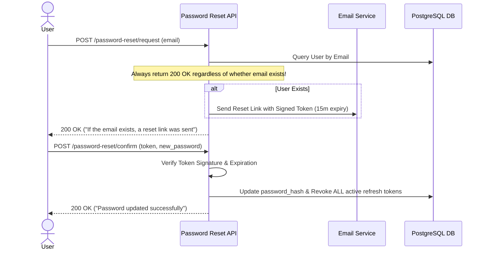

# Phase 23: Secure Password Reset Workflow

> **Author**: Senior Backend Architect & Security Lead  
> **Phase**: 23 of 35  
> **Target Path**: `docs/23-password-reset.md`  

---

## 1. Learning Objectives

By completing this phase, you will master:
* Generating time-limited cryptographic password reset tokens.
* Designing email workflows that prevent user enumeration vulnerabilities.
* Invalidating all active user sessions and refresh tokens immediately upon password reset.

---

## 2. Password Reset Sequence



---

## 3. Code Implementation & Steps

### Step 1: Password Reset Service (`apps/authentication/password_reset.py`)

File path: `apps/authentication/password_reset.py`

```python
"""
Password Reset Service Engine.
Handles password reset token generation, token validation, and account session invalidation.
"""
from django.core.signing import TimestampSigner, BadSignature, SignatureExpired
from apps.users.models import User
from apps.authentication.models import RefreshToken
from core.exceptions import BaseAppException

class PasswordResetService:
    SALT = "apps.authentication.password_reset"

    @classmethod
    def generate_reset_token(cls, user: User) -> str:
        """Generates cryptographic token containing user_id and current password_hash snippet."""
        signer = TimestampSigner(salt=cls.SALT)
        # Including password hash snippet invalidates token immediately if password changes
        payload = f"{user.id}:{user.password[:10]}"
        return signer.sign(payload)

    @classmethod
    def confirm_password_reset(cls, token: str, new_password: str) -> None:
        """
        Validates token and updates user password.
        Invalidates all existing refresh tokens for the user.
        """
        signer = TimestampSigner(salt=cls.SALT)
        try:
            payload = signer.unsign(token, max_age=900) # 15 minutes TTL
            user_id, pwd_snippet = payload.split(":")
        except (SignatureExpired, BadSignature, ValueError):
            raise BaseAppException("Invalid or expired password reset token.", status_code=400)

        user = User.objects.get(id=user_id)
        if user.password[:10] != pwd_snippet:
            raise BaseAppException("Reset token has already been used.", status_code=400)

        # Update password and revoke all sessions
        user.set_password(new_password)
        user.save(update_fields=["password"])
        
        RefreshToken.objects.filter(user=user).update(is_revoked=True)
```

---

## 4. Mentor Mode: Self-Check

### Self-Check Questions
1. Why is embedding a snippet of the user's current `password_hash` inside the signed reset token a smart security design?  
   *Answer: It ensures single-use behavior without database tracking. Once the password is reset, `user.password` changes, rendering any previous reset tokens instantly invalid!*
