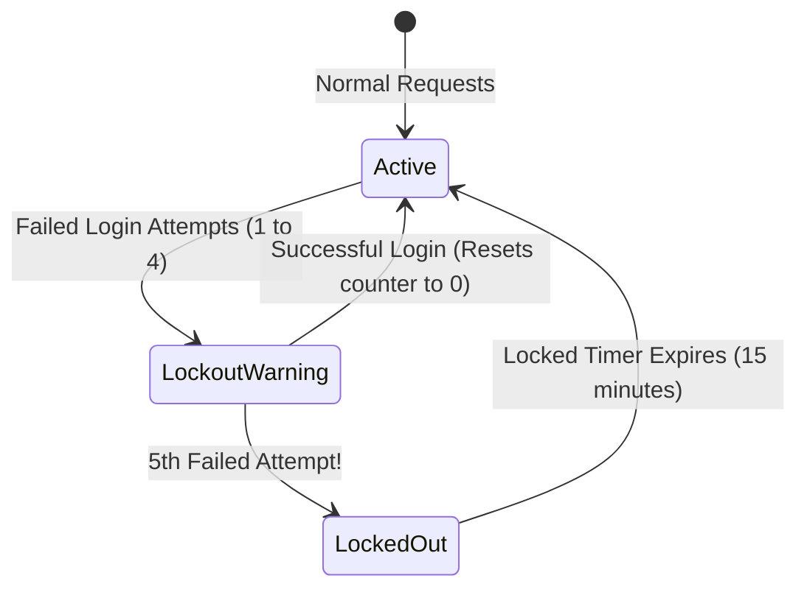

# Phase 26, 27 & 28: Rate Limiting & Brute Force Engine

> **Author**: Senior Backend Architect & Security Lead  
> **Phase**: 26, 27 & 28 of 35  
> **Target Path**: `docs/26-rate-limiting.md`  

---

## 1. Learning Objectives

By completing this phase, you will master:
* Protecting login and sensitive endpoints using a sliding window counter algorithm.
* Building progressive account lockout mechanisms (locking accounts for 15m after 5 failed attempts).
* Defense strategies against credential stuffing, brute-force dictionary attacks, and Denial of Service (DoS).

---

## 2. Sliding Window & Lockout Lifecycle



---

## 3. Code Implementation & Steps

### Step 1: Brute Force & Lockout Engine (`apps/authentication/lockout.py`)

File path: `apps/authentication/lockout.py`

```python
"""
Account Lockout & Brute Force Protection Engine.
Tracks consecutive login failures and enforces temporary account locks.
"""
from datetime import timedelta
from django.utils import timezone
from apps.users.models import User
from core.exceptions import AuthenticationError

class LockoutEngine:
    MAX_FAILED_ATTEMPTS = 5
    LOCKOUT_DURATION_MINUTES = 15

    @classmethod
    def record_failed_attempt(cls, user: User) -> None:
        """
        Increments failed login counter. Locks account if MAX_FAILED_ATTEMPTS reached.
        """
        user.failed_login_attempts += 1
        
        if user.failed_login_attempts >= cls.MAX_FAILED_ATTEMPTS:
            user.locked_until = timezone.now() + timedelta(minutes=cls.LOCKOUT_DURATION_MINUTES)
        
        user.save(update_fields=["failed_login_attempts", "locked_until"])

    @classmethod
    def check_lockout_status(cls, user: User) -> None:
        """
        Verifies if account is currently locked out.
        Automatically unlocks account if lockout duration has passed.
        """
        if user.locked_until:
            if user.locked_until > timezone.now():
                remaining_seconds = int((user.locked_until - timezone.now()).total_seconds())
                raise AuthenticationError(
                    f"Account locked due to too many failed attempts. Try again in {remaining_seconds // 60} minutes.",
                    details={"locked_until": user.locked_until.isoformat()}
                )
            else:
                # Lockout timer expired, unlock account
                user.locked_until = None
                user.failed_login_attempts = 0
                user.save(update_fields=["locked_until", "failed_login_attempts"])
```

---

## 4. Mentor Mode: Self-Check

### Self-Check Questions
1. Why is IP-based rate limiting alone insufficient to block distributed credential stuffing attacks?  
   *Answer: Attackers use botnets with thousands of distinct residential IP addresses. We must enforce rate limiting at both the IP level and the target user/account level.*
