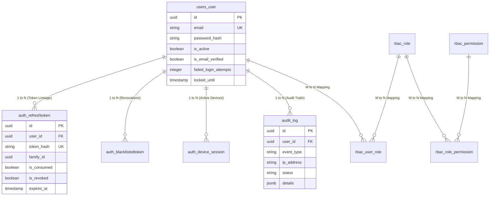
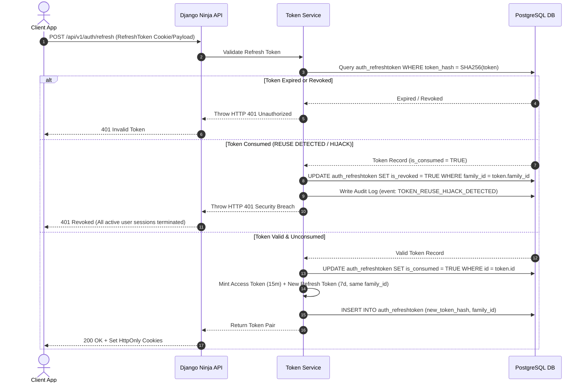

# Enterprise Production-Grade Authentication & Authorization Engine


A battle-tested, enterprise-grade **Authentication & Authorization Subsystem** built from scratch using **Python, Django 5, Django Ninja, and PostgreSQL**. 

Designed to showcase portfolio-quality backend software engineering, clean architecture, threat modeling, and OWASP API security compliance.

---

## 🌟 Architectural Features & Highlights

* **🔐 Custom Identity Engine**: Subclasses `AbstractBaseUser` with UUID primary keys (`gen_random_uuid()`) to prevent sequential resource enumeration attacks.
* **🔄 Refresh Token Rotation (RTR)**: Single-use refresh token exchange with `family_id` lineage tracking. Automatically revokes the entire token family if a consumed token is replayed (Reuse Attack Detection).
* **🍪 Dual Cookie & Bearer Transport**: Serves refresh tokens inside `HttpOnly`, `SameSite=Lax`, and `Secure` cookies to eliminate XSS token theft while supporting mobile Bearer headers.
* **⚡ Instant Revocation & Blacklisting**: Low-latency indexed `auth_blacklistedtoken` table tracking revoked `jti` identifiers for immediate stateless access termination.
* **👥 Dynamic Role-Based Access Control (RBAC)**: Declarative permission evaluation engine supporting roles, granular permissions (`users:delete`), and resource ownership checks (`IsOwnerOrAdmin`).
* **🔒 Account Lockout & Brute-Force Engine**: Tracks consecutive failed login attempts, automatically locking accounts for 15 minutes after 5 consecutive failures with progressive backoff.
* **📜 Immutable Security Audit Logging**: Append-only `audit_log` table storing IP address, User-Agent, action type, and JSONB event details. Automatically masks sensitive fields (`password`, `token`).
* **🛡️ Security Headers & CORS Lockdown**: Custom middleware enforcing `HSTS`, `Content-Security-Policy`, `X-Frame-Options: DENY`, `X-Content-Type-Options: nosniff`, and strict CORS allowlists.
* **🐳 Production Hardening & Containerization**: Multi-stage, unprivileged non-root `Dockerfile` and `docker-compose.yml` orchestration with PostgreSQL.

---

## 🏗️ System Architecture

```text
[ Client Application (SPA / Mobile) ]
                 |
                 v  HTTPS / TLS 1.3
   [ Enterprise Reverse Proxy (Nginx) ]  ---> SSL Termination & Header Injection
                 |
                 v
   [ Security Headers Middleware ]       ---> OWASP Headers, Timing, IP Tracker
                 |
                 v
      [ Django Ninja API Layer ]         ---> Pydantic V2 Schema Validation & Sanitation
                 |
                 v
     [ Service Layer (Auth Engine) ]     ---> Business Logic, Token Rotation, bcrypt
                 |
        +--------+--------+
        |                 |
        v                 v
[ PostgreSQL Database ] [ SMTP Email Server ]
```

---

## 🗄️ PostgreSQL Database Relational Schema



---

## 🔄 Refresh Token Rotation (RTR) Sequence



---

## 📖 Complete 35-Phase Master Documentation Index

All curriculum documentation, code walkthroughs, design trade-offs, and technical interview preparation guides are available in the [`docs/`](file:///e:/backend_engineering/docs/) directory:

| Phase | Documentation Guide | Description |
| :--- | :--- | :--- |
| **01** | [docs/00-roadmap.md](docs/00-roadmap.md) & [docs/01-requirements.md](docs/01-requirements.md) | Master Curriculum Roadmap, Requirements & Schema Design |
| **02** | [docs/02-auth-vs-authz.md](docs/02-auth-vs-authz.md) | AuthN vs AuthZ Theory & Exception Hierarchy |
| **03** | [docs/03-security-fundamentals.md](docs/03-security-fundamentals.md) | STRIDE Threat Model & Cryptographic Utilities |
| **04** | [docs/04-database-design.md](docs/04-database-design.md) | PostgreSQL 3NF DDL & Index Optimization Blueprint |
| **05** | [docs/05-project-setup.md](docs/05-project-setup.md) | Clean Architecture Django & Django Ninja Setup |
| **06** | [docs/06-environment-config.md](docs/06-environment-config.md) | 12-Factor Config Loader & Secret Isolation |
| **07** | [docs/07-user-model.md](docs/07-user-model.md) | Custom User Model (`AbstractBaseUser` + UUID) |
| **08-09** | [docs/08-registration.md](docs/08-registration.md) | Registration Engine & Pydantic V2 Complexity Validation |
| **10** | [docs/10-email-verification.md](docs/10-email-verification.md) | Stateless Signed Email Verification Engine |
| **11-12**| [docs/11-login.md](docs/11-login.md) | Constant-Time Login Engine & bcrypt Cryptography |
| **13-14**| [docs/13-jwt-architecture.md](docs/13-jwt-architecture.md) | JWT Claims Anatomy & Access Token Engine |
| **15-17**| [docs/15-refresh-tokens.md](docs/15-refresh-tokens.md) | Refresh Token Rotation (RTR) & Instant Blacklisting |
| **18-19**| [docs/18-session-management.md](docs/18-session-management.md) | Active Device Sessions & Dual `HttpOnly` Cookies |
| **20** | [docs/20-middleware.md](docs/20-middleware.md) | OWASP Security Headers Middleware |
| **21-22**| [docs/21-authorization.md](docs/21-authorization.md) | Granular Role-Based Access Control (RBAC) Engine |
| **23** | [docs/23-password-reset.md](docs/23-password-reset.md) | Single-Use Signed Password Reset Engine |
| **24-25**| [docs/24-logging.md](docs/24-logging.md) | Structured JSON Logging & Security Audit Trail |
| **26-28**| [docs/26-rate-limiting.md](docs/26-rate-limiting.md) | Account Lockout & Brute Force Protection Engine |
| **29-30**| [docs/29-security-headers-cors.md](docs/29-security-headers-cors.md) | CORS Lockdown & Production Hardening |
| **31** | [docs/31-testing.md](docs/31-testing.md) | Pytest Test Suite & Security Edge-Case Fixtures |
| **32-33**| [docs/32-docker.md](docs/32-docker.md) | Multi-Stage Non-Root Dockerfile & Docker Compose |
| **34** | [docs/34-pen-testing-owasp.md](docs/34-pen-testing-owasp.md) | OWASP API Security Top 10 Audit Checklist |
| **35** | [docs/35-interview-prep.md](docs/35-interview-prep.md) | System Design Whiteboard Scenarios & Senior Q&A |

---

## ⚡ API Endpoint Specification

| Endpoint | Method | Auth Required | Description | Expected Status |
| :--- | :--- | :--- | :--- | :--- |
| `/api/v1/auth/register` | `POST` | None | Registers a new user account & sends verification email | `201 Created` / `400` / `409` |
| `/api/v1/auth/verify-email` | `POST` | None | Verifies user email via signed token | `200 OK` / `400` |
| `/api/v1/auth/login` | `POST` | None | Authenticates user & issues access/refresh tokens | `200 OK` / `401` / `423` |
| `/api/v1/auth/refresh` | `POST` | Cookie / Body | Performs Refresh Token Rotation (RTR) | `200 OK` / `401` |
| `/api/v1/auth/logout` | `POST` | Bearer Token | Revokes refresh token & blacklists access token JTI | `200 OK` / `401` |
| `/api/v1/auth/me` | `GET` | Bearer Token | Fetches authenticated user profile & permissions | `200 OK` / `401` |
| `/api/v1/auth/password-reset/request` | `POST` | None | Sends password reset email (Enumeration Safe) | `200 OK` |
| `/api/v1/auth/password-reset/confirm` | `POST` | None | Resets password & invalidates all active sessions | `200 OK` / `400` |

---

## 📂 Enterprise Clean Architecture Layout

```text
backend-engineering/
├── .env.example                # Configuration blueprint template
├── .gitignore                  # Production Git exclusions
├── requirements.txt            # Explicit dependency pins
├── Dockerfile                  # Multi-stage unprivileged Docker build
├── docker-compose.yml          # Container orchestration (Web + PostgreSQL)
├── docs/                       # Complete 35-phase Markdown guides
├── config/                     # Enterprise Settings Package
│   ├── settings/
│   │   ├── base.py             # Core settings
│   │   ├── development.py      # Local development overrides
│   │   └── production.py       # Hardened production settings
│   ├── api.py                  # Django Ninja API instance & exception handlers
│   └── urls.py                 # Core routing table
├── apps/                       # Modular Monolith Domain Apps
│   ├── users/                  # Custom AbstractBaseUser & User Manager
│   ├── authentication/         # JWT, bcrypt, Rotation, Blacklist Engine
│   ├── audit/                  # Immutable Security Audit Logging
│   └── rbac/                   # Role & Permission Engine
├── core/                       # Shared Utilities, Middleware & Exceptions
└── tests/                      # Pytest Test Suite (Unit & Integration)
```

---

## 🚀 Quickstart & Local Setup

### 1. Prerequisites
* Python 3.12+
* PostgreSQL 16+
* Git

### 2. Environment Setup
Clone the repository and copy the environment blueprint:
```bash
git clone https://github.com/SANJAYRAM-DS/backend-engineering.git
cd backend-engineering
cp .env.example .env
```

### 3. Virtual Environment & Dependencies
```bash
python -m venv .venv
# Linux/macOS
source .venv/bin/activate
# Windows
.venv\Scripts\activate

pip install -r requirements.txt
```

### 4. Database Setup & Migrations
Ensure PostgreSQL is running and update credentials in `.env`:
```bash
python manage.py makemigrations
python manage.py migrate
python manage.py createsuperuser
```

### 5. Running Development Server
```bash
python manage.py runserver
```
Visit Interactive Swagger API Docs: `http://127.0.0.1:8000/docs`

### 6. Running Test Suite
```bash
pytest --cov=apps --cov=core
```

---

## 🐳 Docker Deployment

To launch the complete infrastructure using Docker Compose:
```bash
docker-compose up --build -d
```
Access API container at `http://localhost:8000/docs`.

---

## 🛡️ OWASP API Security Compliance Alignment

* **API1:2023 Broken Object Level Authorization (BOLA)**: Enforces `IsOwnerOrAdmin` permission checkers on resource endpoints.
* **API2:2023 Broken Authentication**: Enforces `bcrypt` cost factor 12, short-lived JWTs, and Refresh Token Rotation (RTR).
* **API3:2023 Broken Property Level Authorization**: Filters incoming payloads using strict Pydantic V2 input schemas.
* **API4:2023 Unrestricted Resource Consumption**: Sliding window rate limits and 5-attempt account lockouts.
* **API8:2023 Security Misconfiguration**: Automated OWASP response header injection (`nosniff`, `DENY`, `HSTS`, `CSP`).

---

## 📜 License

Distributed under the MIT License. See `LICENSE` for more information.

---

## 👤 Author & Maintainer

**Sanjay Ram**  
*Senior Backend Engineer & Software Architect*  
* GitHub: [@SANJAYRAM-DS](https://github.com/SANJAYRAM-DS)  
* Project Repo: [SANJAYRAM-DS/backend-engineering](https://github.com/SANJAYRAM-DS/backend-engineering)
