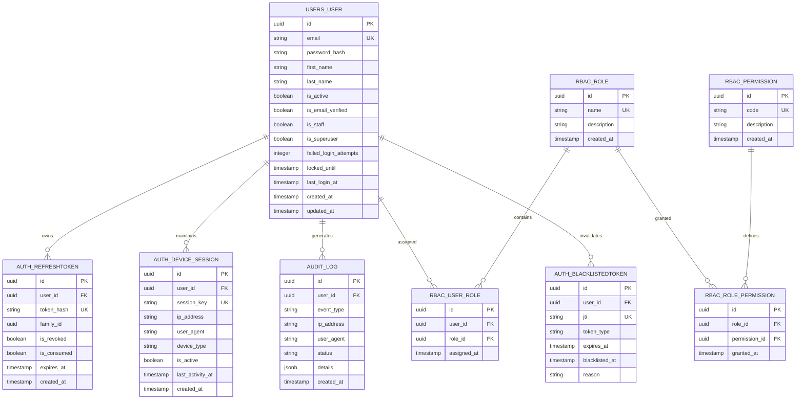
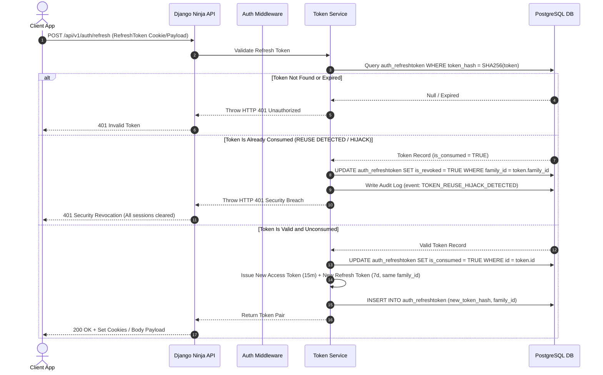

# Phase 1: Requirements Analysis & System Design

> **Scope**: System Requirements, Deep Security Theory, PostgreSQL Normalization, Enterprise Architecture, API Specs, Configuration  

---

## 1. Learning Objectives

In this phase, you will master:
* The fundamental theoretical and practical differences between **Authentication (AuthN)** and **Authorization (AuthZ)**.
* How to formulate comprehensive **Functional**, **Non-Functional**, and **Security Requirements** for an enterprise system.
* How to design a fully normalized, performance-indexed **PostgreSQL relational database schema** for authentication and audit logging.
* How to read and create **Mermaid ER Diagrams** and **Sequence Diagrams** representing complex request lifecycles.
* The structure of an **Enterprise Clean Architecture** project layout using **Django** and **Django Ninja**.

---

## 2. Deep Theory: Authentication vs. Authorization

Before building an authentication system, you must eliminate the common confusion between Authentication and Authorization. They are distinct security pillars.

```text
+-----------------------------------------------------------------------------------+
|                                  SECURITY ENGINE                                  |
+-----------------------------------------------------------------------------------+
|                                                                                   |
|  [ AUTHENTICATION (AuthN) ]               [ AUTHORIZATION (AuthZ) ]               |
|  "Who are you?"                           "What are you allowed to do?"           |
|                                                                                   |
|  * Verifies Identity                      * Verifies Permissions                  |
|  * Inputs: Username, Password, OTP        * Inputs: User ID, Role, Resource, Verb  |
|  * Produces: Principal (Authenticated User)* Produces: Allow / Deny Verdict       |
|  * Example: Logging in with Password      * Example: Deleting an User Account     |
|                                                                                   |
+-----------------------------------------------------------------------------------+
```

### 2.1 Authentication (AuthN)
* **Definition**: Authentication is the process of verifying the claim of identity presented by an actor (user, service, or device).
* **Analogy**: Showing your passport or driver's license at an airport security checkpoint. The border officer checks the photo and cryptographic signatures to verify *who you are*.
* **Mechanisms**:
  * **Something you know**: Password, PIN, security answers.
  * **Something you have**: Time-based One-Time Password (TOTP) app, Hardware Security Key (YubiKey), SMS code.
  * **Something you are**: Fingerprint, facial recognition, retina scan.
* **Our Project Implementation**: Credential validation using email and bcrypt-hashed passwords, issuing short-lived JSON Web Tokens (JWT).

### 2.2 Authorization (AuthZ)
* **Definition**: Authorization is the process of determining whether an authenticated actor has permission to perform a specific action on a specific resource.
* **Analogy**: Using your boarding pass at the airport gate. The gate agent checks if your ticket authorizes you to board flight AC123 and sit in seat 14B.
* **Mechanisms**:
  * **Role-Based Access Control (RBAC)**: Users are assigned roles (e.g., `Admin`, `Auditor`, `Standard User`); roles contain permissions (e.g., `user:delete`, `audit:read`).
  * **Attribute-Based Access Control (ABAC)**: Access granted based on attributes (e.g., time of day, user location, resource owner).
* **Our Project Implementation**: Declarative RBAC combined with Resource Ownership checks (`IsOwnerOrAdmin`).

---

## 3. System Requirements Specification

### 3.1 Functional Requirements (FR)
1. **User Identity & Account Management**:
   * Users can register using a unique email address and a strong password.
   * New accounts require email address verification via cryptographic single-use tokens before granting full platform access.
   * Users can request a password reset via email with a time-limited token.
2. **Authentication & Token Lifecycle**:
   * Users can log in using email and password to receive a **Short-Lived Access Token** (15 mins) and a **Long-Lived Refresh Token** (7 days).
   * The system must implement **Refresh Token Rotation (RTR)**: exchanging a refresh token invalidates the old refresh token and issues a new pair.
   * The system must detect **Token Reuse**: if an already-consumed refresh token is presented, the system immediately invalidates the entire token family (revoking all descendant and parent tokens).
   * Users can explicitly log out, adding tokens to a **Token Blacklist**.
3. **Session & Device Auditability**:
   * The system tracks active user devices, including IP addresses and User-Agent strings.
   * Users can view active sessions and revoke sessions remotely ("Logout from all devices").
4. **Role-Based Access Control (RBAC)**:
   * System administrators can create roles and bind granular permissions to roles.
   * Users can be assigned multiple roles; permissions resolve dynamically.
5. **Security & Protection Systems**:
   * Consecutive failed login attempts trigger progressive backoff and account lockouts (5 failed attempts lock the account for 15 minutes).
   * IP-based and User-based rate limiting (60 requests/minute global endpoint limits).
   * Every security-sensitive event (login, failure, password change, permission escalation, token revocation) writes an immutable audit record.

### 3.2 Non-Functional Requirements (NFR)
1. **Performance**:
   * Token verification middleware response latency must be under **5ms** (in-memory parsing with minimal DB lookup for blacklists).
   * Database queries for user lookup and authentication must utilize indexes, executing under **10ms**.
2. **Security & Cryptography**:
   * Passwords hashed using `bcrypt` (work factor 12) or `Argon2id`. Plaintext passwords must NEVER touch persistent storage or logs.
   * JWT tokens signed using `HS256` (or `RS256` asymmetric keys) with strong secret key entropy (>= 256 bits).
   * Transport security enforced via HTTP-Only, SameSite, and Secure flags on cookies.
3. **Scalability & Maintainability**:
   * Modular clean architecture allowing independent testing of services, repositories, and handlers.
   * Stateless access token architecture allowing horizontal API scaling.

---

## 4. PostgreSQL Relational Database Schema Design

### 4.1 ER Diagram (Mermaid)



### 4.2 Detailed Table Specifications

#### Table 1: `users_user`
* **Purpose**: Primary identity record storing user credentials, account status, and lockout tracking.
* **Columns**:
  * `id` (`UUID`, Primary Key, default `gen_random_uuid()`): Universally unique identifier prevents sequential ID enumeration attacks.
  * `email` (`VARCHAR(255)`, UNIQUE, NOT NULL): User identifier. Lowercase indexed for O(1) login lookups.
  * `password_hash` (`VARCHAR(255)`, NOT NULL): Stored bcrypt/Argon2 digest string.
  * `is_active` (`BOOLEAN`, DEFAULT `TRUE`): Soft-delete / account status flag.
  * `is_email_verified` (`BOOLEAN`, DEFAULT `FALSE`): Blocks platform privileges until email link is verified.
  * `failed_login_attempts` (`INTEGER`, DEFAULT 0): Tracks consecutive bad logins.
  * `locked_until` (`TIMESTAMPTZ`, NULLABLE): Account lockout expiration timestamp.
  * `created_at` / `updated_at` (`TIMESTAMPTZ`, NOT NULL): Audit timestamps.
* **Indexes**: `CREATE UNIQUE INDEX idx_users_email ON users_user (LOWER(email));`

#### Table 2: `auth_refreshtoken`
* **Purpose**: Stores active refresh tokens for Rotation (RTR) and reuse detection.
* **Columns**:
  * `id` (`UUID`, PK)
  * `user_id` (`UUID`, FK -> `users_user.id` ON DELETE CASCADE)
  * `token_hash` (`VARCHAR(64)`, UNIQUE, NOT NULL): SHA-256 hash of the actual refresh token string.
  * `family_id` (`UUID`, NOT NULL): Tracks all token lineage stemming from a single login event.
  * `is_revoked` (`BOOLEAN`, DEFAULT `FALSE`): Set to TRUE when explicitly logged out or hijacked.
  * `is_consumed` (`BOOLEAN`, DEFAULT `FALSE`): Set to TRUE after being exchanged once during rotation.
  * `expires_at` (`TIMESTAMPTZ`, NOT NULL)
* **Indexes**: `CREATE INDEX idx_refresh_token_hash ON auth_refreshtoken (token_hash);`, `CREATE INDEX idx_refresh_family ON auth_refreshtoken (family_id);`

#### Table 3: `auth_blacklistedtoken`
* **Purpose**: Instant token revocation store for access tokens (JTI) and revoked refresh tokens.
* **Columns**:
  * `id` (`UUID`, PK)
  * `user_id` (`UUID`, FK -> `users_user.id` ON DELETE CASCADE)
  * `jti` (`VARCHAR(255)`, UNIQUE, NOT NULL): Unique JWT ID claim.
  * `token_type` (`VARCHAR(20)`, NOT NULL): `'access'` or `'refresh'`.
  * `expires_at` (`TIMESTAMPTZ`, NOT NULL): Used by automated cleanup cron jobs.
  * `blacklisted_at` (`TIMESTAMPTZ`, default `NOW()`).

#### Table 4: `audit_log`
* **Purpose**: Append-only security audit log recording every sensitive operation.
* **Columns**:
  * `id` (`UUID`, PK)
  * `user_id` (`UUID`, FK -> `users_user.id` ON DELETE SET NULL): Retains log even if user account is deleted.
  * `event_type` (`VARCHAR(50)`, NOT NULL): E.g., `user.login.success`, `user.login.failed`, `token.revoked`.
  * `ip_address` (`INET`, NOT NULL): Client IP.
  * `user_agent` (`TEXT`, NOT NULL): Browser/Client identifier string.
  * `status` (`VARCHAR(20)`, NOT NULL): `SUCCESS`, `FAILURE`, `BLOCKED`.
  * `details` (`JSONB`, NOT NULL): Flexible event metadata payload.
* **Indexes**: `CREATE INDEX idx_audit_event_type ON audit_log (event_type);`, `CREATE INDEX idx_audit_user_created ON audit_log (user_id, created_at DESC);`

---

## 5. System Architecture & Request Lifecycle

### 5.1 High-Level Architecture

```text
[ Client Application (Web / Mobile) ]
                 |
                 v  HTTPS / TLS 1.3
   [ Enterprise Nginx Reverse Proxy ]  ---> Filters Malicious Headers & SSL Termination
                 |
                 v
   [ Custom Django Security Middleware ] ---> Rate Limiter, IP Filter, Security Headers
                 |
                 v
      [ Django Ninja API Layer ]       ---> Schema Parsing (Pydantic), Validation
                 |
                 v
     [ Service Layer (Auth Engine) ]   ---> Business Logic, Token Rotation, Hashing
                 |
        +--------+--------+
        |                 |
        v                 v
[ PostgreSQL Database ] [ SMTP Email Server ]
```

### 5.2 Refresh Token Rotation Sequence (Mermaid)



---

## 6. API Specification Matrix

| Endpoint | Method | Auth Required | Description | Status Codes |
| :--- | :--- | :--- | :--- | :--- |
| `/api/v1/auth/register` | `POST` | None | Registers a new user account & sends verification email | `201 Created`, `400 Bad Request`, `409 Conflict` |
| `/api/v1/auth/verify-email` | `POST` | None | Verifies user email via token | `200 OK`, `400 Bad Request` |
| `/api/v1/auth/login` | `POST` | None | Authenticates user credentials & issues JWT token pair | `200 OK`, `401 Unauthorized`, `423 Locked` |
| `/api/v1/auth/refresh` | `POST` | None (Refresh Cookie) | Performs Refresh Token Rotation (RTR) to issue new token pair | `200 OK`, `401 Unauthorized` |
| `/api/v1/auth/logout` | `POST` | Bearer Access Token | Revokes current refresh token & blacklists access token | `200 OK`, `401 Unauthorized` |
| `/api/v1/auth/me` | `GET` | Bearer Access Token | Fetches current user profile & permissions | `200 OK`, `401 Unauthorized` |
| `/api/v1/auth/password-reset/request` | `POST` | None | Sends a time-limited password reset email | `200 OK` (Always returns 200 to prevent user enumeration) |
| `/api/v1/auth/password-reset/confirm` | `POST` | None | Resets password using valid cryptographic reset token | `200 OK`, `400 Bad Request` |

---

## 7. Enterprise Folder Structure Design

```text
backend_engineering/
├── .env.example                # Blueprint for required environment variables
├── .gitignore                  # Git tracking exclusion list
├── requirements.txt            # Explicit dependency pins
├── manage.py                   # Django CLI entrypoint
├── docs/                       # Comprehensive architectural & phase documentation
│   ├── 00-roadmap.md           # Master curriculum roadmap
│   └── 01-requirements.md      # Phase 1 complete system specification
├── config/                     # Enterprise Settings Package
│   ├── __init__.py
│   ├── settings/
│   │   ├── __init__.py
│   │   ├── base.py             # Shared settings (Installed apps, middleware, DB setup)
│   │   ├── development.py      # Dev settings (Debug=True, console email backend)
│   │   └── production.py       # Hardened prod settings (HTTPS, Strict cookies, security headers)
│   ├── urls.py                 # Core routing table
│   ├── api.py                  # Django Ninja API instance & exception handlers
│   └── wsgi.py / asgi.py       # Production server entrypoints
├── apps/                       # Modular Application Domains
│   ├── __init__.py
│   ├── users/                  # User identity domain
│   │   ├── __init__.py
│   │   ├── models.py           # Custom AbstractBaseUser model
│   │   ├── schemas.py          # Pydantic user payloads & responses
│   │   ├── services.py         # User creation & profile logic
│   │   └── selectors.py        # Database query selectors
│   ├── authentication/         # Security & Token domain
│   │   ├── __init__.py
│   │   ├── models.py           # RefreshToken & BlacklistedToken models
│   │   ├── api.py              # Ninja router endpoints (register, login, refresh, logout)
│   │   ├── services.py         # JWT issuing, rotation, bcrypt comparison logic
│   │   ├── schemas.py          # Token requests & response schemas
│   │   └── security.py         # Custom HTTPBearer & Cookie security schemes
│   ├── audit/                  # Security Audit Domain
│   │   ├── __init__.py
│   │   ├── models.py           # AuditLog immutable model
│   │   └── services.py         # Audit logging helper service
│   └── rbac/                   # Role & Permission Domain
│       ├── __init__.py
│       ├── models.py           # Role, Permission, UserRole models
│       └── services.py         # Permission checking & evaluation engine
├── core/                       # Shared Core Utilities & Base Classes
│   ├── __init__.py
│   ├── exceptions.py           # Application domain exceptions
│   ├── middleware.py           # Security headers, rate limiting, request timing
│   └── utils.py                # Security helper functions
└── tests/                      # Pytest Test Suite
    ├── __init__.py
    ├── conftest.py             # Shared Pytest fixtures
    ├── unit/                   # Unit tests (Services, Utilities)
    └── integration/            # Integration API tests (Endpoints, DB)
```

---

## 8. Mentor Mode: Review, Exercises & Interview Prep

### 8.1 Phase 1 Summary
In this phase, we established the technical blueprint for an enterprise authentication system. We defined the exact boundary between AuthN and AuthZ, mapped functional security requirements against threat models, designed a PostgreSQL schema using UUIDs and Refresh Token Rotation (RTR), and crafted an enterprise Clean Architecture project structure.

### 8.2 Self-Check Review Questions
1. Why do we use UUIDs instead of auto-incrementing integers (`BIGINT`) for primary keys in security tables?
2. What is Refresh Token Rotation (RTR), and how does single-use token consumption protect users from session hijacking?
3. Why should the Password Reset Request endpoint return HTTP 200 even if the submitted email does not exist in the database?

### 8.3 Hands-On Exercises
* **Exercise 1**: Draw out the database foreign key relationships for the RBAC domain (`rbac_role`, `rbac_permission`, `rbac_user_role`, `rbac_role_permission`).
* **Exercise 2**: Modify the `.env.example` file to include settings for an external Redis server (to be used later for rate-limiting sliding windows).

### 8.4 Technical Interview Questions & Model Answers

#### Question 1 (Beginner): What is the difference between Authentication and Authorization?
* **Answer**: Authentication verifies *who a user is* (e.g., verifying a username and password). Authorization determines *what an authenticated user is permitted to do* (e.g., checking if a user has permission to delete a record).

#### Question 2 (Intermediate): What is User Enumeration, and how do we prevent it during Login and Password Reset flows?
* **Answer**: User Enumeration occurs when an attacker uses API response differences (such as error messages like "User not found" vs "Invalid password" or varying HTTP response times) to discover valid email addresses registered on a platform. We prevent this by returning generic error messages (e.g., "Invalid credentials") and using constant-time response logic.

#### Question 3 (Advanced): How does Refresh Token Rotation (RTR) handle token theft, and what is "Family Invalidation"?
* **Answer**: In RTR, every refresh token can only be used *once* to get a new access/refresh token pair. All tokens stemming from a login session share a `family_id`. If an attacker steals a consumed refresh token and presents it, the system detects that `is_consumed == True`. Recognizing a security breach, the system immediately revokes **all tokens sharing that `family_id`**, logging out both the legitimate user and the attacker, thus neutralizing the stolen session.

---

## 9. Next Steps

With Phase 1 requirements, database design, architecture, and configuration blueprints finalized, we are ready to set up the project environment and build the **Custom User Model** in Phase 2 & 7.
