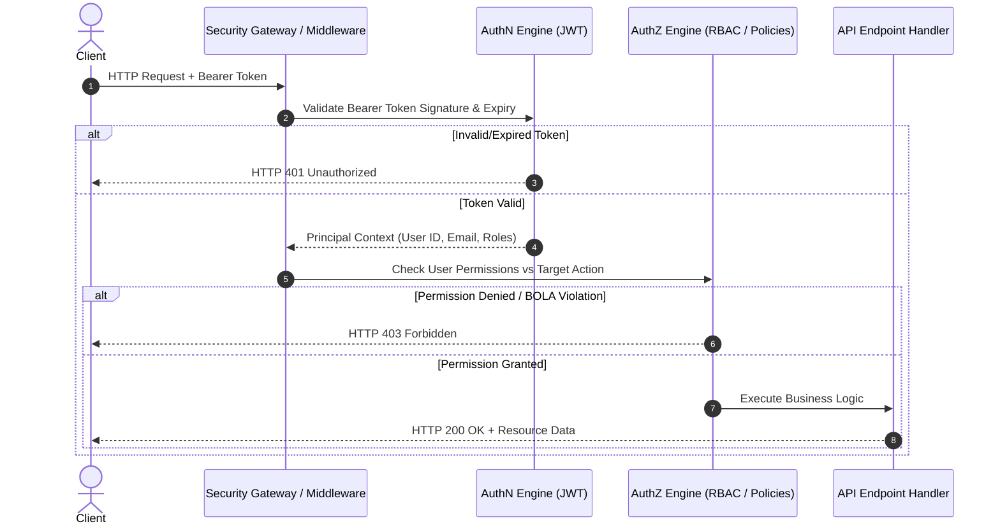

# Phase 02: Authentication vs Authorization Deep Dive

> **Phase**: 02 of 35  
> **Target Path**: `docs/02-auth-vs-authz.md`  

---

## 1. Learning Objectives

By completing this phase, you will be able to:
* Contrast the cryptographic, structural, and behavioral differences between **Authentication (AuthN)** and **Authorization (AuthZ)**.
* Explain the request execution flow when an API request passes through AuthN vs AuthZ layers.
* Implement custom authorization primitives and permission checkers in Python/Django.
* Prevent **Insecure Direct Object References (IDOR)** and **Broken Object Level Authorization (BOLA)** vulnerabilities (OWASP API #1).

---

## 2. Deep Theory

### 2.1 Comparative Paradigm

| Dimension | Authentication (AuthN) | Authorization (AuthZ) |
| :--- | :--- | :--- |
| **Core Question** | *"Who are you?"* | *"What are you permitted to do?"* |
| **Stage in Pipeline** | Executed **FIRST** upon receiving request | Executed **SECOND** after identity is established |
| **Input Data** | Passwords, TOTP tokens, API keys, WebAuthn | User ID, Roles, Permissions, Resource Owner ID, Attributes |
| **Output / Outcome** | Validated Identity Principal (e.g., `user_id = 42`) | Binary Verdict: `ALLOW` or `DENY` |
| **Error Status Code** | `HTTP 401 Unauthorized` | `HTTP 403 Forbidden` |
| **Failure Meaning** | Identity unverified or token invalid/missing | Identity verified, but lacks sufficient privileges |

---

## 3. Architecture & Request Pipeline



---

## 4. Code Implementation & Steps

### Step 1: Create Core Exceptions (`core/exceptions.py`)

File path: `core/exceptions.py`

```python
"""
Core Application Exception Hierarchy.
Enforces distinct HTTP status codes for AuthN vs AuthZ failures.
"""
from typing import Any, Dict, Optional

class BaseAppException(Exception):
    """Base exception class for enterprise application domain."""
    def __init__(self, message: str, status_code: int = 400, details: Optional[Dict[str, Any]] = None):
        super().__init__(message)
        self.message = message
        self.status_code = status_code
        self.details = details or {}

class AuthenticationError(BaseAppException):
    """
    Raised when identity verification fails (HTTP 401 Unauthorized).
    Examples: Invalid password, expired JWT, bad signature.
    """
    def __init__(self, message: str = "Authentication failed. Invalid or missing credentials.", details: Optional[Dict[str, Any]] = None):
        super().__init__(message=message, status_code=401, details=details)

class AuthorizationError(BaseAppException):
    """
    Raised when authenticated user lacks permissions (HTTP 403 Forbidden).
    Examples: Non-admin accessing admin endpoint, IDOR attempt.
    """
    def __init__(self, message: str = "Permission denied. Insufficient privileges.", details: Optional[Dict[str, Any]] = None):
        super().__init__(message=message, status_code=403, details=details)
```

### Step 2: Implement Permission Checking Primitive (`core/permissions.py`)

File path: `core/permissions.py`

```python
"""
Authorization Primitives & Declarative Permission Classes.
"""
from abc import ABC, abstractmethod
from typing import Any
from django.http import HttpRequest
from core.exceptions import AuthorizationError

class BasePermission(ABC):
    """Abstract Base Permission interface for all AuthZ checkers."""
    
    @abstractmethod
    def has_permission(self, request: HttpRequest) -> bool:
        """Check global endpoint permission."""
        pass

    def has_object_permission(self, request: HttpRequest, obj: Any) -> bool:
        """Check resource-level (BOLA / IDOR) permission."""
        return True

class IsAuthenticated(BasePermission):
    """AuthN check primitive: Verifies user principal is attached to request."""
    def has_permission(self, request: HttpRequest) -> bool:
        user = getattr(request, "user", None)
        return user is not None and user.is_authenticated

class IsOwnerOrAdmin(BasePermission):
    """
    AuthZ check primitive: Grants access if user is superuser/admin 
    OR is the owner of the target domain resource.
    """
    def has_permission(self, request: HttpRequest) -> bool:
        return IsAuthenticated().has_permission(request)

    def has_object_permission(self, request: HttpRequest, obj: Any) -> bool:
        user = request.user
        if user.is_superuser or getattr(user, "is_staff", False):
            return True
        
        # Check ownership attribute
        owner_id = getattr(obj, "user_id", getattr(obj, "owner_id", None))
        if owner_id is not None:
            return str(owner_id) == str(user.id)
        
        return False
```

---

## 5. Security & OWASP Deep-Dive

### OWASP API #1: Broken Object Level Authorization (BOLA) / IDOR
* **The Threat**: An attacker changes `GET /api/v1/users/101/profile` to `GET /api/v1/users/102/profile`. If the application only checks AuthN (is logged in) and fails to enforce AuthZ (does user 101 own profile 102?), data leaks occur.
* **The Prevention**: Always execute `has_object_permission(request, object)` before returning resource data.

---

## 6. Mentor Mode: Review & Interview Prep

### Self-Check Questions
1. Why returning HTTP 401 for an unauthorized resource access is a security compliance violation?
2. How does `IsOwnerOrAdmin` prevent IDOR attacks?

### Technical Interview Questions
* **Q**: What is the HTTP status code difference between invalid credentials during login vs valid credentials attempting an admin action?  
  **A**: Invalid credentials during login return `HTTP 401 Unauthorized`. Valid user credentials attempting an admin action return `HTTP 403 Forbidden`.