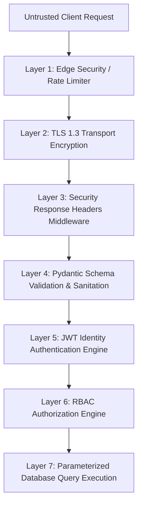

# Phase 03: Security Fundamentals & Threat Modeling

> **Phase**: 03 of 35  
> **Target Path**: `docs/03-security-fundamentals.md`  

---

## 1. Learning Objectives

By completing this phase, you will master:
* Applying the **STRIDE** threat modeling framework to web API authentication.
* Enforcing **Defense-in-Depth** and the **Principle of Least Privilege** across modern API architectures.
* Preventing top web vulnerabilities: SQL Injection, XSS, CSRF, Replay Attacks, and Credential Stuffing.

---

## 2. Theoretical Frameworks

### 2.1 STRIDE Threat Model Matrix for Auth APIs

| Threat Category | Definition | Real-World Attack Vector | System Defense Countermeasure |
| :--- | :--- | :--- | :--- |
| **S**poofing | Impersonating another user or service | Stealing JWT refresh tokens to forge request identity | Refresh Token Rotation (RTR) + IP/User-Agent Binding |
| **T**ampering | Modifying data in transit or storage | Altering claims inside JWT header/payload | Cryptographic signature verification (`HS256`/`RS256`) |
| **R**epudiation | Denying an action was performed | User claims they didn't initiate account deletion | Immutable, append-only `AuditLog` table with IP/Timestamp |
| **I**nformation Disclosure | Unauthorized data leakage | Leaking user email existence via error message differences | Generic error payloads & constant-time authentication |
| **D**enial of Service | Exhausting system availability | Brute-force dictionary login flooding API endpoints | Sliding window Rate Limiting + Account Lockout Engine |
| **E**levation of Privilege | Ungranted permission escalation | Modifying request JSON to set `"is_superuser": true` | Strict Pydantic input schemas filtering forbidden fields |

---

## 3. Defense Architecture



---

## 4. Code Implementation & Steps

### Step 1: Implement Security Utilities (`core/utils.py`)

File path: `core/utils.py`

```python
"""
Core Cryptographic & Security Utilities.
Provides constant-time string comparisons, secure token generation, and input sanitization.
"""
import hmac
import secrets
import hashlib
from typing import str

def generate_secure_token(length: int = 32) -> str:
    """
    Generates a cryptographically secure random url-safe token string.
    Uses OS-level entropy source via Python's secrets module.
    """
    return secrets.token_urlsafe(length)

def hash_token(token: str) -> str:
    """
    Computes SHA-256 hash of a string.
    Used for storing token hashes in database without raw token exposure.
    """
    return hashlib.sha256(token.encode("utf-8")).hexdigest()

def safe_constant_time_compare(val1: str, val2: str) -> bool:
    """
    Compares two strings in constant time to prevent timing attacks.
    Prevents attackers from deducing secret strings character-by-character.
    """
    return hmac.compare_digest(val1.encode("utf-8"), val2.encode("utf-8"))
```

---

## 5. OWASP Top 10 Mitigation Matrix

1. **SQL Injection**: Prevented by Django ORM parameterized query generation. Plain string formatting (`f"SELECT * FROM users WHERE email='{email}'"`) is strictly forbidden.
2. **Cross-Site Scripting (XSS)**: Prevented by serving access/refresh tokens via `HttpOnly` cookies, preventing `document.cookie` execution access.
3. **Cross-Site Request Forgery (CSRF)**: Prevented by `SameSite=Lax` or `SameSite=Strict` cookie policies combined with custom `X-CSRF-Token` headers.

---

## 6. Mentor Mode: Review & Exercises

### Self-Check Questions
1. Why is `secrets.token_urlsafe()` preferred over `random.urandom()` or `random.randint()` for security tokens?  
   *Answer: `random` uses pseudo-random algorithms (Mersenne Twister) which are deterministic if the seed is discovered. `secrets` uses OS CSPRNG (Cryptographically Secure Pseudo-Random Number Generator).*
