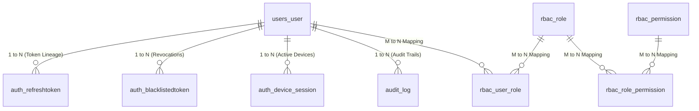

# Phase 04: Database Design & PostgreSQL Normalization

> **Phase**: 04 of 35  
> **Target Path**: `docs/04-database-design.md`  

---

## 1. Learning Objectives

By completing this phase, you will master:
* Designing a fully normalized **3NF Relational Database Schema** for enterprise security.
* Implementing UUID primary keys, foreign key cascading strategies, and index optimizations.
* Formulating SQL DDL migrations and indexing patterns for high-throughput authentication queries.

---

## 2. Complete Relational Database Model



---

## 3. Detailed Column Specification & Index Rationale

### 3.1 `users_user`
* `id` (`UUID` PK): Prevents sequential integer enumeration.
* `email` (`VARCHAR(255)` UNIQUE): Case-insensitive unique index (`LOWER(email)`).
* `password_hash` (`VARCHAR(255)`): Standard length for bcrypt/Argon2 KDF strings.
* `is_email_verified` (`BOOLEAN`): Gating access control.
* `failed_login_attempts` (`INTEGER`): Counter for progressive account lockout.
* `locked_until` (`TIMESTAMPTZ`): Temporary lockout expiration timestamp.

---

## 4. SQL DDL & Migration Reference (`docs/04-database-design.md`)

```sql
-- PostgreSQL Enterprise DDL Blueprint

CREATE EXTENSION IF NOT EXISTS "uuid-ossp";

-- Core User Table
CREATE TABLE users_user (
    id UUID PRIMARY KEY DEFAULT gen_random_uuid(),
    email VARCHAR(255) NOT NULL UNIQUE,
    password_hash VARCHAR(255) NOT NULL,
    first_name VARCHAR(100) NOT NULL DEFAULT '',
    last_name VARCHAR(100) NOT NULL DEFAULT '',
    is_active BOOLEAN NOT NULL DEFAULT TRUE,
    is_email_verified BOOLEAN NOT NULL DEFAULT FALSE,
    is_staff BOOLEAN NOT NULL DEFAULT FALSE,
    is_superuser BOOLEAN NOT NULL DEFAULT FALSE,
    failed_login_attempts INTEGER NOT NULL DEFAULT 0,
    locked_until TIMESTAMPTZ NULL,
    last_login_at TIMESTAMPTZ NULL,
    created_at TIMESTAMPTZ NOT NULL DEFAULT NOW(),
    updated_at TIMESTAMPTZ NOT NULL DEFAULT NOW()
);

-- Case-insensitive Unique Index for Email
CREATE UNIQUE INDEX idx_users_email_lower ON users_user (LOWER(email));

-- Refresh Token Rotation Table
CREATE TABLE auth_refreshtoken (
    id UUID PRIMARY KEY DEFAULT gen_random_uuid(),
    user_id UUID NOT NULL REFERENCES users_user(id) ON DELETE CASCADE,
    token_hash VARCHAR(64) NOT NULL UNIQUE,
    family_id UUID NOT NULL,
    is_revoked BOOLEAN NOT NULL DEFAULT FALSE,
    is_consumed BOOLEAN NOT NULL DEFAULT FALSE,
    expires_at TIMESTAMPTZ NOT NULL,
    created_at TIMESTAMPTZ NOT NULL DEFAULT NOW()
);

CREATE INDEX idx_refresh_token_hash ON auth_refreshtoken (token_hash);
CREATE INDEX idx_refresh_family_id ON auth_refreshtoken (family_id);

-- Token Blacklist Table
CREATE TABLE auth_blacklistedtoken (
    id UUID PRIMARY KEY DEFAULT gen_random_uuid(),
    user_id UUID NOT NULL REFERENCES users_user(id) ON DELETE CASCADE,
    jti VARCHAR(255) NOT NULL UNIQUE,
    token_type VARCHAR(20) NOT NULL,
    expires_at TIMESTAMPTZ NOT NULL,
    blacklisted_at TIMESTAMPTZ NOT NULL DEFAULT NOW(),
    reason VARCHAR(100) NOT NULL DEFAULT 'logout'
);

CREATE INDEX idx_blacklist_jti ON auth_blacklistedtoken (jti);
```

---

## 5. Mentor Mode: Self-Check & Exercises

### Self-Check Questions
1. Why does `audit_log` use `ON DELETE SET NULL` for `user_id` instead of `ON DELETE CASCADE`?  
   *Answer: Deleting a user must never wipe security audit logs. Regulatory compliance requires audit logs to remain immutable even after user deletion.*
