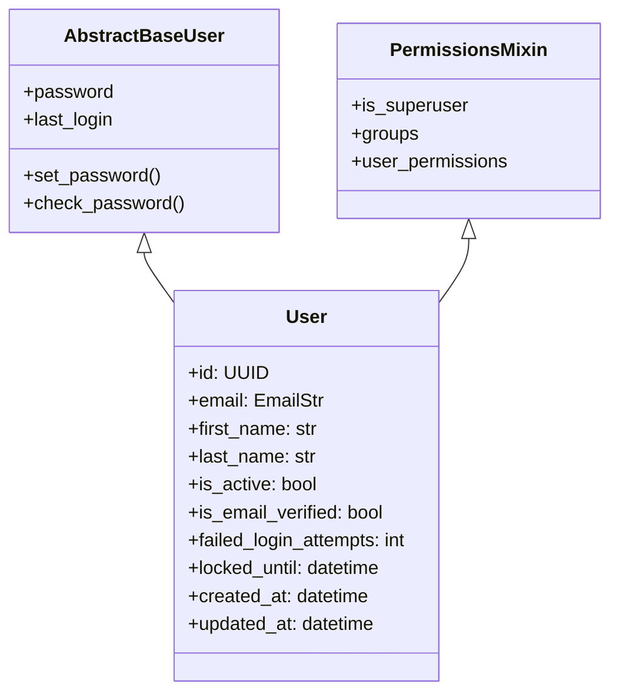

# Phase 07: Custom User Model Architecture

> **Phase**: 07 of 35  
> **Target Path**: `docs/07-user-model.md`  

---

## 1. Learning Objectives

By completing this phase, you will master:
* Subclassing Django's `AbstractBaseUser` and `PermissionsMixin` to build a clean identity model.
* Creating a custom `BaseUserManager` enforcing email normalization and UUID generation.
* Implementing account lockout tracking attributes (`failed_login_attempts`, `locked_until`).

---

## 2. Architecture & Class Hierarchy



---

## 3. Code Implementation & Steps

### Step 1: User Manager & Model (`apps/users/models.py`)

File path: `apps/users/models.py`

```python
"""
Custom User Identity Model & Manager.
Subclasses AbstractBaseUser and PermissionsMixin for UUID primary key and email authentication.
"""
import uuid
from django.db import models
from django.contrib.auth.models import AbstractBaseUser, BaseUserManager, PermissionsMixin
from django.utils import timezone

class UserManager(BaseUserManager):
    """Custom manager handling user and superuser creation with email normalization."""
    
    def create_user(self, email: str, password: str = None, **extra_fields):
        if not email:
            raise ValueError("The Email address must be provided.")
        email = self.normalize_email(email).lower()
        user = self.model(email=email, **extra_fields)
        if password:
            user.set_password(password)
        else:
            user.set_unusable_password()
        user.save(using=self._db)
        return user

    def create_superuser(self, email: str, password: str = None, **extra_fields):
        extra_fields.setdefault("is_staff", True)
        extra_fields.setdefault("is_superuser", True)
        extra_fields.setdefault("is_active", True)
        extra_fields.setdefault("is_email_verified", True)

        if extra_fields.get("is_staff") is not True:
            raise ValueError("Superuser must have is_staff=True.")
        if extra_fields.get("is_superuser") is not True:
            raise ValueError("Superuser must have is_superuser=True.")

        return self.create_user(email, password, **extra_fields)

class User(AbstractBaseUser, PermissionsMixin):
    """Primary User Account Entity."""
    id = models.UUIDField(primary_key=True, default=uuid.uuid4, editable=False)
    email = models.EmailField(unique=True, max_length=255, db_index=True)
    first_name = models.CharField(max_length=100, blank=True, default="")
    last_name = models.CharField(max_length=100, blank=True, default="")
    
    is_active = models.BooleanField(default=True)
    is_email_verified = models.BooleanField(default=False)
    is_staff = models.BooleanField(default=False)
    
    failed_login_attempts = models.IntegerField(default=0)
    locked_until = models.DateTimeField(null=True, blank=True)
    last_login_at = models.DateTimeField(null=True, blank=True)
    
    created_at = models.DateTimeField(auto_now_add=True)
    updated_at = models.DateTimeField(auto_now=True)

    objects = UserManager()

    USERNAME_FIELD = "email"
    REQUIRED_FIELDS = []

    class Meta:
        db_table = "users_user"
        ordering = ["-created_at"]

    def __str__(self) -> str:
        return self.email

    @property
    def is_locked(self) -> bool:
        """Returns True if user account is currently locked out."""
        if self.locked_until and self.locked_until > timezone.now():
            return True
        return False
```

---

## 4. Mentor Mode: Self-Check & Exercises

### Self-Check Questions
1. Why is `USERNAME_FIELD = "email"` set on our `User` model?  
   *Answer: To tell Django's authentication framework to use `email` as the primary unique credential instead of the legacy `username` field.*