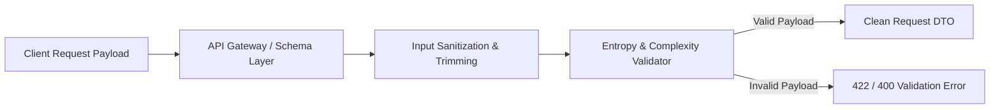

# Phase 09: Strict Schema & Input Sanitation

> **Author**: Senior Backend Architect & Security Lead  
> **Phase**: 09 of 35  
> **Target Path**: `docs/09-validation-sanitation.md`  

---

## 1. Learning Objectives

By completing this phase, you will master:
* Designing strict Pydantic V2 validation layers that block malformed data at the API gateway boundary.
* Implementing input sanitization pipelines against XSS, SQL injection, and zero-day payload exploits.
* Enforcing password entropy checkers, custom validators, and normalization rules (e.g. email lowercasing & trimming).
* Utilizing Data Transfer Objects (DTOs) to isolate database models from client request/response payloads.

---

## 2. Input Validation & Sanitization Architecture



### Key Principles of Input Sanitation:
1. **Never Trust Client Data**: Every string, query param, header, and JSON attribute is untrusted.
2. **Whitelisting over Blacklisting**: Specify exact expected types, regex patterns, and length limits rather than attempting to filter out known bad strings.
3. **Canonical Normalization**: Standardize input (e.g., lowercasing emails, trimming whitespace, stripping non-printable characters) *before* validation.

---

## 3. Production Pydantic V2 Implementation

File path: `apps/users/schemas.py`

```python
"""
Pydantic V2 Schemas for Strict Input Sanitation and Validation.
"""
import re
import html
from pydantic import BaseModel, EmailStr, Field, field_validator
from typing import Optional
from uuid import UUID
from datetime import datetime

def sanitize_string(value: str) -> str:
    """Strips leading/trailing whitespace and escapes HTML special characters to mitigate XSS."""
    if not isinstance(value, str):
        return value
    clean_val = value.strip()
    return html.escape(clean_val)


class UserRegisterSchema(BaseModel):
    email: EmailStr
    password: str = Field(..., min_length=12, max_length=128, description="Must meet enterprise entropy standards")
    first_name: str = Field(default="", max_length=100)
    last_name: str = Field(default="", max_length=100)

    @field_validator("email", mode="before")
    @classmethod
    def normalize_email(cls, value: str) -> str:
        """Trims whitespace and lowercases email address."""
        if isinstance(value, str):
            return value.strip().lower()
        return value

    @field_validator("first_name", "last_name", mode="before")
    @classmethod
    def sanitize_names(cls, value: str) -> str:
        """Sanitizes user name inputs."""
        return sanitize_string(value)

    @field_validator("password")
    @classmethod
    def validate_password_complexity(cls, value: str) -> str:
        """
        Enforces password complexity:
        - At least 1 uppercase letter
        - At least 1 lowercase letter
        - At least 1 numeric digit
        - At least 1 special character
        - Disallows common sequential characters (e.g. 123456, qwerty)
        """
        if not re.search(r"[A-Z]", value):
            raise ValueError("Password must contain at least one uppercase letter.")
        if not re.search(r"[a-z]", value):
            raise ValueError("Password must contain at least one lowercase letter.")
        if not re.search(r"\d", value):
            raise ValueError("Password must contain at least one numeric digit.")
        if not re.search(r"[!@#$%^&*(),.?\":{}|<>]", value):
            raise ValueError("Password must contain at least one special character.")
        
        common_patterns = ["123456", "password", "qwerty", "admin123"]
        if any(pattern in value.lower() for pattern in common_patterns):
            raise ValueError("Password contains overly common or insecure character sequences.")

        return value


class UserResponseDTO(BaseModel):
    """
    Response DTO guaranteeing no sensitive authentication attributes 
    (such as password_hash or verification tokens) are ever exposed.
    """
    id: UUID
    email: EmailStr
    first_name: str
    last_name: str
    is_active: bool
    is_email_verified: bool
    created_at: datetime

    class Config:
        from_attributes = True
```

---

## 4. Mentor Mode: Self-Check & Exercises

### Self-Check Questions
1. **Why is it important to perform string normalization (like email lowercasing) before database queries and validation?**  
   *Answer: Emails are case-insensitive by specification (RFC 5321). Failing to normalize leads to duplicate accounts (`User@Domain.com` vs `user@domain.com`) and authentication bypass bugs.*

2. **Why should response models (DTOs) explicitly define fields instead of dumping the ORM model dict directly?**  
   *Answer: Dumping ORM dicts directly runs the severe security risk of over-exposing internal database fields like `password_hash`, internal flags, or private metadata to the client.*

### Practical Exercise
* Extend `UserRegisterSchema` to reject disposable/temporary email provider domains (e.g., `@mailinator.com`, `@tempmail.com`) using a custom `@field_validator`.
