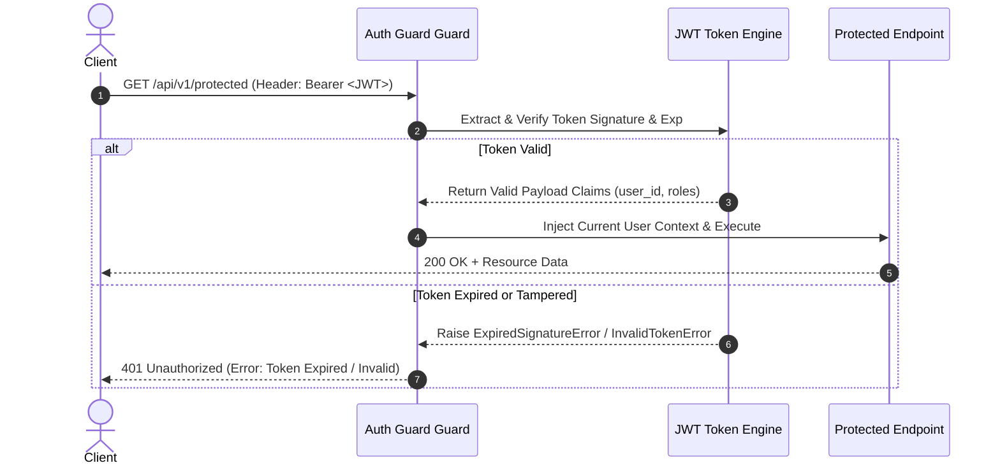

# Phase 14: Access Token Generation & Verification

> **Phase**: 14 of 35  
> **Target Path**: `docs/14-access-tokens.md`  

---

## 1. Learning Objectives

By completing this phase, you will master:
* Minting secure, short-lived JSON Web Tokens (JWT) for stateless client authentication.
* Building a high-performance verification engine that validates token signature, expiration (`exp`), issuer (`iss`), and audience (`aud`).
* Handling custom token exceptions (`ExpiredSignatureError`, `DecodeError`, `InvalidTokenError`).
* Integrating authorization header extraction (`Authorization: Bearer <token>`) into request authentication guards.

---

## 2. Access Token Lifecycle Architecture



---

## 3. Production Access Token Engine Implementation

File path: `core/security/tokens.py`

```python
"""
JWT Access Token Issuance and Verification Module using PyJWT.
"""
import jwt
from datetime import datetime, timedelta, timezone
from uuid import UUID
from typing import Dict, Any
from django.conf import settings
from core.exceptions import AuthenticationException


class AccessTokenEngine:
    
    @staticmethod
    def create_access_token(user_id: UUID, roles: list[str], extra_claims: Dict[str, Any] = None) -> str:
        """
        Mints a short-lived access token signed with HMAC-SHA256 (HS256) or RS256.
        Default expiration: 15 minutes.
        """
        now = datetime.now(timezone.utc)
        payload = {
            "sub": str(user_id),
            "type": "access",
            "roles": roles,
            "iss": settings.JWT_ISSUER,
            "aud": settings.JWT_AUDIENCE,
            "iat": now,
            "exp": now + timedelta(minutes=settings.JWT_ACCESS_TOKEN_EXPIRE_MINUTES),
        }
        
        if extra_claims:
            payload.update(extra_claims)

        token = jwt.encode(
            payload,
            settings.JWT_SECRET_KEY,
            algorithm=settings.JWT_ALGORITHM
        )
        return token

    @staticmethod
    def decode_and_verify_access_token(token: str) -> Dict[str, Any]:
        """
        Verifies the cryptographic signature and standard claims of an incoming access token.
        Raises AuthenticationException on signature mismatch, expiration, or invalid claims.
        """
        try:
            payload = jwt.decode(
                token,
                settings.JWT_SECRET_KEY,
                algorithms=[settings.JWT_ALGORITHM],
                issuer=settings.JWT_ISSUER,
                audience=settings.JWT_AUDIENCE,
                options={"verify_exp": True, "verify_iss": True, "verify_aud": True}
            )
            
            if payload.get("type") != "access":
                raise AuthenticationException("Invalid token type. Expected access token.", status_code=401)
                
            return payload

        except jwt.ExpiredSignatureError:
            raise AuthenticationException("Access token has expired. Please refresh your session.", status_code=401)
        except jwt.InvalidTokenError as e:
            raise AuthenticationException(f"Invalid access token: {str(e)}", status_code=401)
```

---

## 4. Mentor Mode: Self-Check & Exercises

### Self-Check Questions
1. **Why must access tokens have short lifespans (e.g. 15 minutes) instead of long lifespans (e.g. 30 days)?**  
   *Answer: Because JWT access tokens are validated statelessly without hitting the database. Short lifespans minimize the window of vulnerability if a token is intercepted or leaked on the client side.*

2. **Why is verifying the `type` claim (`"type": "access"`) strictly necessary during verification?**  
   *Answer: Without explicit type checking, an attacker could present a valid Refresh Token or Password Reset Token to an endpoint expecting an Access Token, leading to unauthorized access.*

### Practical Exercise
* Write a Pytest unit test enforcing that passing an expired token or a token signed with an incorrect secret key immediately returns a `401 Unauthorized` exception.
