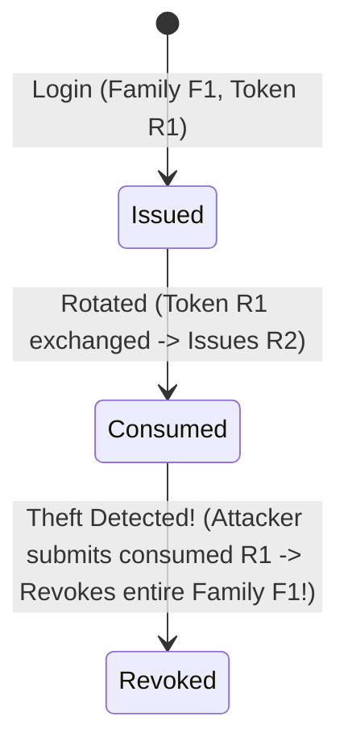

# Phase 15: Refresh Token Rotation (RTR) Engine

> **Phase**: 15 of 35  
> **Target Path**: `docs/15-refresh-tokens.md`  

---

## 1. Learning Objectives

By completing this phase, you will master:
* Implementing **Refresh Token Rotation (RTR)** to limit the lifetime of refresh credentials.
* Building **Reuse Detection Engine**: revoking entire token families upon detecting stolen refresh tokens.
* Maintaining an indexed PostgreSQL token blacklist for instant access revocation.

---

## 2. Refresh Token Rotation (RTR) Flow



---

## 3. Code Implementation & Steps

### Step 1: Refresh Token Database Models (`apps/authentication/models.py`)

File path: `apps/authentication/models.py`

```python
"""
Database Models for Refresh Tokens, Token Rotation Families, and Blacklisting.
"""
import uuid
from django.db import models
from django.conf import settings

class RefreshToken(models.Model):
    id = models.UUIDField(primary_key=True, default=uuid.uuid4, editable=False)
    user = models.ForeignKey(settings.AUTH_USER_MODEL, on_delete=models.CASCADE, related_name="refresh_tokens")
    token_hash = models.CharField(max_length=64, unique=True, db_index=True)
    family_id = models.UUIDField(db_index=True)
    
    is_revoked = models.BooleanField(default=False)
    is_consumed = models.BooleanField(default=False)
    
    expires_at = models.DateTimeField()
    created_at = models.DateTimeField(auto_now_add=True)

    class Meta:
        db_table = "auth_refreshtoken"

class BlacklistedToken(models.Model):
    id = models.UUIDField(primary_key=True, default=uuid.uuid4, editable=False)
    user = models.ForeignKey(settings.AUTH_USER_MODEL, on_delete=models.CASCADE, related_name="blacklisted_tokens")
    jti = models.CharField(max_length=255, unique=True, db_index=True)
    token_type = models.CharField(max_length=20, choices=[("access", "Access"), ("refresh", "Refresh")])
    expires_at = models.DateTimeField()
    blacklisted_at = models.DateTimeField(auto_now_add=True)
    reason = models.CharField(max_length=100, default="logout")

    class Meta:
        db_table = "auth_blacklistedtoken"
```

### Step 2: Refresh Token Rotation Logic (`apps/authentication/rotation.py`)

File path: `apps/authentication/rotation.py`

```python
"""
Refresh Token Rotation & Reuse Detection Service Engine.
"""
from datetime import datetime, timedelta, timezone
import uuid
from django.db import transaction
from apps.authentication.models import RefreshToken
from apps.authentication.jwt import JWTService
from core.utils import hash_token
from core.exceptions import AuthenticationError

class RefreshTokenRotationService:

    @classmethod
    @transaction.atomic
    def rotate_refresh_token(cls, raw_refresh_token: str) -> dict:
        """
        Exchanges a valid refresh token for a new token pair.
        Triggers family revocation if reuse of a consumed token is detected.
        """
        token_hash = hash_token(raw_refresh_token)
        try:
            token_obj = RefreshToken.objects.select_for_update().get(token_hash=token_hash)
        except RefreshToken.DoesNotExist:
            raise AuthenticationError("Invalid refresh token.")

        # REUSE DETECTION: If token was already consumed, revoke entire family!
        if token_obj.is_consumed:
            RefreshToken.objects.filter(family_id=token_obj.family_id).update(is_revoked=True)
            raise AuthenticationError("Security Breach: Token reuse detected! Session revoked.")

        if token_obj.is_revoked:
            raise AuthenticationError("Refresh token has been revoked.")

        if token_obj.expires_at < datetime.now(timezone.utc):
            raise AuthenticationError("Refresh token expired.")

        # Mark current token as consumed
        token_obj.is_consumed = True
        token_obj.save(update_fields=["is_consumed"])

        # Generate new token pair under same family_id
        new_access_token = JWTService.create_access_token(str(token_obj.user.id), token_obj.user.email)
        new_raw_refresh = str(uuid.uuid4())
        
        RefreshToken.objects.create(
            user=token_obj.user,
            token_hash=hash_token(new_raw_refresh),
            family_id=token_obj.family_id,
            expires_at=datetime.now(timezone.utc) + timedelta(days=7),
        )

        return {
            "access_token": new_access_token,
            "refresh_token": new_raw_refresh,
        }
```

---

## 4. Mentor Mode: Self-Check

### Self-Check Questions
1. Why is `select_for_update()` used when querying `RefreshToken` during rotation?  
   *Answer: To acquire a PostgreSQL row lock. This prevents race conditions where two simultaneous requests attempt to rotate the same refresh token concurrently.*