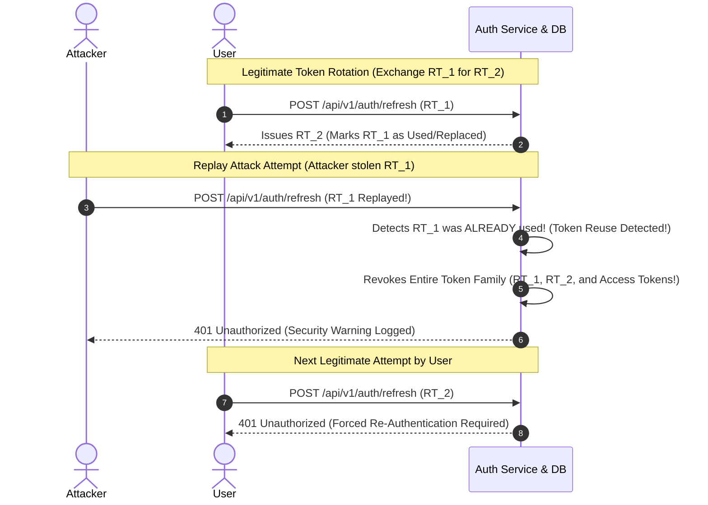

# Phase 16: Automatic Token Reuse Detection & Revocation

> **Phase**: 16 of 35  
> **Target Path**: `docs/16-token-reuse-detection.md`  

---

## 1. Learning Objectives

By completing this phase, you will master:
* Understanding the Refresh Token Reuse Attack vector in OAuth 2.0 / JWT architectures.
* Implementing Token Family Tracking to group access and refresh tokens minted from a single authentication event.
* Building automatic revocation triggers that invalidate an entire token family instantly upon detecting replayed/stolen refresh tokens.
* Logging security alerts and revoking active sessions across distributed database nodes.

---

## 2. Token Reuse Threat Model & Security Lifecycle



---

## 3. Automatic Token Reuse Detection Implementation

File path: `apps/tokens/services.py`

```python
"""
Token Reuse Detection & Family Revocation Engine.
"""
import uuid
from django.db import transaction
from apps.tokens.models import RefreshToken
from core.exceptions import SecurityException, AuthenticationException
import logging

logger = logging.getLogger("security.audit")


class TokenRotationService:

    @staticmethod
    @transaction.atomic
    def rotate_refresh_token(raw_token: str, ip_address: str, user_agent: str) -> dict:
        """
        Rotates a refresh token while strictly enforcing reuse detection rules.
        If a used/revoked token is submitted again, immediately revokes the entire token family.
        """
        token_hash = RefreshToken.hash_token(raw_token)
        token_record = RefreshToken.objects.select_for_update().filter(token_hash=token_hash).first()

        if not token_record:
            raise AuthenticationException("Invalid or non-existent refresh token.", status_code=401)

        # SECURITY RULE: Check if token has ALREADY been used or revoked
        if token_record.is_used or token_record.is_revoked:
            family_id = token_record.family_id
            user_id = token_record.user_id

            # REUSE DETECTED! Instantly revoke all active tokens belonging to this family
            revoked_count = RefreshToken.objects.filter(
                family_id=family_id,
                is_revoked=False
            ).update(is_revoked=True)

            logger.critical(
                f"SECURITY ALERT: Token reuse detected! Family ID: {family_id}, User ID: {user_id}. "
                f"Invalidated {revoked_count} tokens. IP: {ip_address}, UA: {user_agent}"
            )

            raise SecurityException(
                message="Security violation: Replayed token detected. Session terminated across all devices.",
                status_code=401
            )

        # Mark current token as used
        token_record.is_used = True
        token_record.save(update_fields=["is_used"])

        # Issue new child token belonging to the same family
        new_token_str = str(uuid.uuid4())
        new_token_record = RefreshToken.objects.create(
            user=token_record.user,
            token_hash=RefreshToken.hash_token(new_token_str),
            family_id=token_record.family_id, # Inherit family context
            parent=token_record,
            ip_address=ip_address,
            user_agent=user_agent
        )

        return {
            "refresh_token": new_token_str,
            "family_id": str(token_record.family_id)
        }
```

---

## 4. Mentor Mode: Self-Check & Exercises

### Self-Check Questions
1. **Why must we revoke the ENTIRE token family when token reuse is detected, rather than just rejecting the single replayed request?**  
   *Answer: Because we cannot determine whether the legitimate user or the attacker holds the newer child token (`RT_2`). Invalidating the entire family guarantees that the attacker loses access while prompting the legitimate user to safely re-authenticate.*

2. **Why is `select_for_update()` essential during token rotation DB lookups?**  
   *Answer: It locks the token record in the database during the transaction, preventing race conditions where two simultaneous requests could execute token rotation before the `is_used` flag is set.*

### Practical Exercise
* Write a unit test simulating simultaneous concurrent refresh requests using Python's `asyncio` or multi-threading, proving that race conditions cannot bypass reuse detection.
