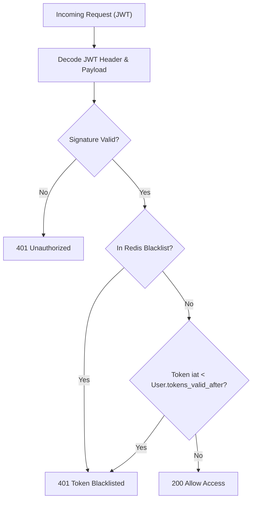

# Phase 17: Token Blacklisting & Invalidation Database Engine

> **Author**: Senior Backend Architect & Security Lead  
> **Phase**: 17 of 35  
> **Target Path**: `docs/17-token-blacklisting.md`  

---

## 1. Learning Objectives

By completing this phase, you will master:
* Solving the "Stateless JWT Revocation Problem" through high-speed token blacklisting.
* Designing optimized database tables and Redis cache layers for revoked token verification.
* Implementing automated TTL (Time-To-Live) cleanup cron jobs for expired blacklisted entries.
* Supporting global user logout ("Log out from all devices") via user-level token invalidation timestamps (`tokens_valid_after`).

---

## 2. Token Blacklisting Architecture



---

## 3. Production Blacklisting Database & Cache Engine

### PostgreSQL Schema & Django Model

File path: `apps/tokens/models.py`

```python
"""
Database Models for Revoked Tokens and User Token Invalidation.
"""
from django.db import models
import uuid

class BlacklistedToken(models.Model):
    id = models.UUIDField(primary_key=True, default=uuid.uuid4, editable=False)
    jti = models.CharField(max_length=255, unique=True, db_index=True, help_text="JWT Unique Identifier")
    user = models.ForeignKey("users.User", on_delete=models.CASCADE, related_name="blacklisted_tokens")
    expires_at = models.DateTimeField(db_index=True, help_text="Matches token exp claim for cleanup")
    blacklisted_at = models.DateTimeField(auto_now_add=True)
    reason = models.CharField(max_length=100, default="user_logout")

    class Meta:
        db_table = "auth_blacklisted_tokens"
        indexes = [
            models.Index(fields=["jti", "expires_at"], name="idx_blacklisted_jti_exp"),
        ]

    def __str__(self):
        return f"Blacklisted JTI {self.jti} (User {self.user_id})"
```

### High-Speed Redis + DB Verification Service

File path: `apps/tokens/services.py`

```python
"""
Token Blacklist Service using Redis for low-latency checks (<1ms) 
backed by PostgreSQL for persistence.
"""
from django.core.cache import cache
from datetime import datetime, timezone
from apps.tokens.models import BlacklistedToken
from apps.users.models import User


class TokenBlacklistService:

    CACHE_PREFIX = "token_blacklist:"

    @classmethod
    def blacklist_jti(cls, jti: str, user_id: str, expires_at: datetime, reason: str = "logout") -> None:
        """
        Blacklists a token by its JTI (JWT ID) in both Redis and PostgreSQL.
        Calculates remaining TTL to automatically expire Redis keys when JWT expires.
        """
        now = datetime.now(timezone.utc)
        ttl = int((expires_at - now).total_seconds())

        if ttl > 0:
            # 1. Store in high-speed Redis cache
            cache_key = f"{cls.CACHE_PREFIX}{jti}"
            cache.set(cache_key, "revoked", timeout=ttl)

            # 2. Persist in DB for audit trail
            BlacklistedToken.objects.get_or_create(
                jti=jti,
                defaults={
                    "user_id": user_id,
                    "expires_at": expires_at,
                    "reason": reason
                }
            )

    @classmethod
    def is_jti_blacklisted(cls, jti: str) -> bool:
        """
        Checks if JTI is present in Redis or DB.
        """
        cache_key = f"{cls.CACHE_PREFIX}{jti}"
        if cache.get(cache_key) is not None:
            return True

        # Fallback to DB check if Redis key missed
        return BlacklistedToken.objects.filter(jti=jti).exists()

    @classmethod
    def revoke_all_user_sessions(cls, user: User) -> None:
        """
        Invalidates ALL active tokens for a user by updating `tokens_valid_after` timestamp.
        """
        user.tokens_valid_after = datetime.now(timezone.utc)
        user.save(update_fields=["tokens_valid_after"])
```

---

## 4. Mentor Mode: Self-Check & Exercises

### Self-Check Questions
1. **Why is storing a `jti` (JWT ID) in Redis better than storing the full JWT string?**  
   *Answer: JTIs are short UUIDs (36 characters). Storing raw JWT strings wastes significant memory across millions of cache keys. JTIs minimize Redis memory consumption.*

2. **How does `user.tokens_valid_after` achieve instant "Logout All Devices" without inserting thousands of token JTIs into the DB?**  
   *Answer: By storing a single timestamp on the User model, any token issued prior to that timestamp (`token.iat < user.tokens_valid_after`) is immediately rejected during verification in a single comparison.*

### Practical Exercise
* Implement a Celery or Django management command (`python manage.py purge_expired_blacklist`) that deletes records from `BlacklistedToken` where `expires_at < NOW()`.
