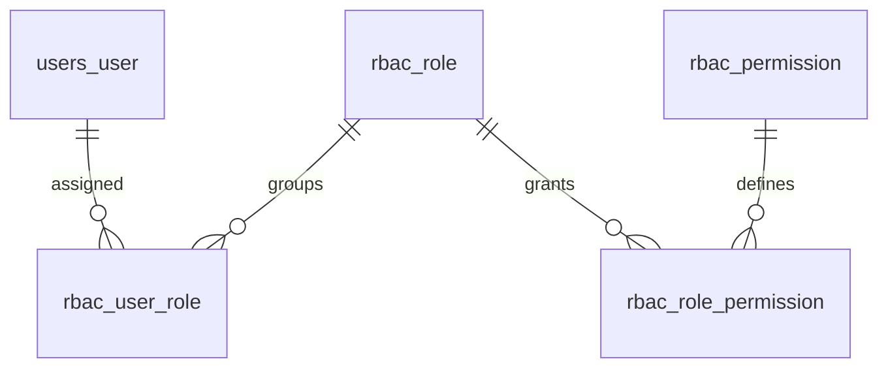

# Phase 21: Authorization Framework & Scope Architecture

> **Author**: Senior Backend Architect & Security Lead  
> **Phase**: 21 of 35  
> **Target Path**: `docs/21-authorization.md`  

---

## 1. Learning Objectives

By completing this phase, you will master:
* Designing an normalized **Role-Based Access Control (RBAC)** model (`Role`, `Permission`, `UserRole`, `RolePermission`).
* Dynamically resolving permissions for authenticated users across multiple assigned roles.
* Enforcing declarative security decorators on Django Ninja API endpoints.

---

## 2. RBAC Entity Relationship Diagram



---

## 3. Code Implementation & Steps

### Step 1: RBAC Models (`apps/rbac/models.py`)

File path: `apps/rbac/models.py`

```python
"""
Role-Based Access Control (RBAC) Database Models.
"""
import uuid
from django.db import models
from django.conf import settings

class Permission(models.Model):
    id = models.UUIDField(primary_key=True, default=uuid.uuid4, editable=False)
    code = models.CharField(max_length=100, unique=True, db_index=True) # e.g. "users:delete"
    description = models.TextField(blank=True, default="")

    class Meta:
        db_table = "rbac_permission"

class Role(models.Model):
    id = models.UUIDField(primary_key=True, default=uuid.uuid4, editable=False)
    name = models.CharField(max_length=50, unique=True)
    description = models.TextField(blank=True, default="")
    permissions = models.ManyToManyField(Permission, through="RolePermission", related_name="roles")

    class Meta:
        db_table = "rbac_role"

class UserRole(models.Model):
    id = models.UUIDField(primary_key=True, default=uuid.uuid4, editable=False)
    user = models.ForeignKey(settings.AUTH_USER_MODEL, on_delete=models.CASCADE, related_name="user_roles")
    role = models.ForeignKey(Role, on_delete=models.CASCADE)
    assigned_at = models.DateTimeField(auto_now_add=True)

    class Meta:
        db_table = "rbac_user_role"
        unique_together = ("user", "role")

class RolePermission(models.Model):
    id = models.UUIDField(primary_key=True, default=uuid.uuid4, editable=False)
    role = models.ForeignKey(Role, on_delete=models.CASCADE)
    permission = models.ForeignKey(Permission, on_delete=models.CASCADE)

    class Meta:
        db_table = "rbac_role_permission"
        unique_together = ("role", "permission")
```

### Step 2: RBAC Evaluation Service (`apps/rbac/services.py`)

File path: `apps/rbac/services.py`

```python
"""
RBAC Permission Resolution Engine.
"""
from typing import Set
from apps.users.models import User
from apps.rbac.models import Permission

class RBACService:

    @staticmethod
    def get_user_permissions(user: User) -> Set[str]:
        """
        Resolves distinct permission codes granted to the user through all assigned roles.
        """
        if user.is_superuser:
            return set(Permission.objects.values_list("code", flat=True))

        return set(
            Permission.objects.filter(
                roles__user_roles__user=user
            ).values_list("code", flat=True)
        )

    @classmethod
    def has_permission(cls, user: User, permission_code: str) -> bool:
        """Checks if user holds a specific permission code."""
        if not user or not user.is_authenticated:
            return False
        return permission_code in cls.get_user_permissions(user)
```

---

## 4. Mentor Mode: Self-Check

### Self-Check Questions
1. How does superuser override bypass database joins during permission evaluation?  
   *Answer: Superusers return all permissions immediately (`user.is_superuser == True`), short-circuiting role queries.*
