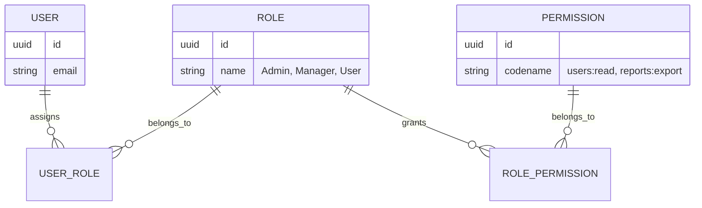

# Phase 22: Granular Role-Based Access Control (RBAC)

> **Author**: Senior Backend Architect & Security Lead  
> **Phase**: 22 of 35  
> **Target Path**: `docs/22-rbac.md`  

---

## 1. Learning Objectives

By completing this phase, you will master:
* Designing scalable Role-Based Access Control (RBAC) schemas using dynamic Roles, Permissions, and Many-to-Many relationships.
* Building permission resolution algorithms with high-performance caching (avoiding N+1 DB queries per request).
* Implementing custom authorization guards and decorators in API view functions (`@has_permission("users:write")`).
* Distinguishing between RBAC (Role-Based) and ABAC (Attribute-Based / Resource Ownership) controls.

---

## 2. RBAC Schema & Relationship Architecture



---

## 3. Production RBAC Implementation

### Database Models

File path: `apps/permissions/models.py`

```python
"""
Role and Permission Models for Granular RBAC.
"""
from django.db import models
import uuid

class Permission(models.Model):
    id = models.UUIDField(primary_key=True, default=uuid.uuid4, editable=False)
    name = models.CharField(max_length=100)
    codename = models.CharField(max_length=100, unique=True, db_index=True) # e.g. "users:delete"
    description = models.TextField(blank=True)

    class Meta:
        db_table = "auth_permissions"

    def __str__(self):
        return self.codename


class Role(models.Model):
    id = models.UUIDField(primary_key=True, default=uuid.uuid4, editable=False)
    name = models.CharField(max_length=50, unique=True)
    description = models.TextField(blank=True)
    permissions = models.ManyToManyField(Permission, related_name="roles", db_table="auth_role_permissions")

    class Meta:
        db_table = "auth_roles"

    def __str__(self):
        return self.name
```

### Permission Guard Decorator & Service

File path: `apps/permissions/guards.py`

```python
"""
RBAC Permission Guards and Caching Layer.
"""
from functools import wraps
from typing import List, Set
from django.core.cache import cache
from core.exceptions import PermissionDeniedException


class RBACService:

    @staticmethod
    def get_user_permissions(user_id: str) -> Set[str]:
        """
        Fetches all permission codenames assigned to a user across all their assigned roles.
        Caches results in Redis to ensure sub-millisecond RBAC evaluation.
        """
        cache_key = f"user_perms:{user_id}"
        cached_perms = cache.get(cache_key)
        
        if cached_perms is not None:
            return set(cached_perms)

        # DB Query joining User -> Roles -> Permissions
        from apps.users.models import User
        user = User.objects.filter(id=user_id).prefetch_related("roles__permissions").first()
        if not user:
            return set()

        perms = set()
        for role in user.roles.all():
            for perm in role.permissions.all():
                perms.add(perm.codename)

        # Cache for 15 minutes
        cache.set(cache_key, list(perms), timeout=900)
        return perms


def has_permission(required_permission: str):
    """
    Decorator for API routes enforcing granular permission checks.
    Usage: @has_permission("users:delete")
    """
    def decorator(func):
        @wraps(func)
        def wrapper(request, *args, **kwargs):
            user = getattr(request, "current_user", None)
            if not user or not user.is_authenticated:
                raise PermissionDeniedException("Authentication required.", status_code=401)

            # Superusers bypass perms
            if getattr(user, "is_superuser", False):
                return func(request, *args, **kwargs)

            user_perms = RBACService.get_user_permissions(str(user.id))
            if required_permission not in user_perms:
                raise PermissionDeniedException(
                    f"Forbidden: Missing required permission '{required_permission}'.", 
                    status_code=403
                )

            return func(request, *args, **kwargs)
        return wrapper
    return decorator
```

---

## 4. Mentor Mode: Self-Check & Exercises

### Self-Check Questions
1. **Why is hardcoding role checks (`if user.role == 'admin'`) bad practice compared to permission checks (`if "users:delete" in perms`)?**  
   *Answer: Hardcoding roles creates brittle code. Permission-based checks allow administrators to dynamically reconfigure or create custom roles with tailored permission sets without changing a single line of backend source code.*

2. **How do we invalidate a user's cached permissions when an admin assigns them a new role?**  
   *Answer: When assigning or removing user roles in `RBACService`, delete the Redis cache key `cache.delete(f"user_perms:{user_id}")` so the next request re-evaluates permissions immediately.*

### Practical Exercise
* Implement a `has_any_permission(["reports:read", "reports:admin"])` decorator allowing access if the user holds at least one of the specified permissions.
