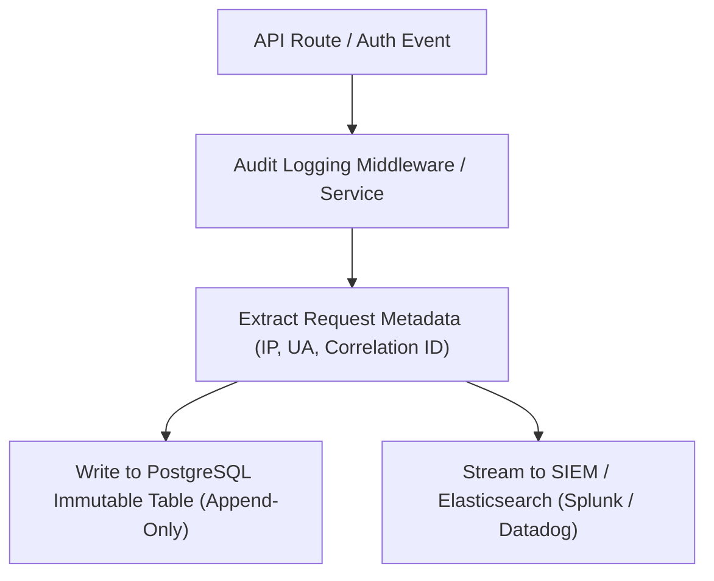

# Phase 25: Immutable Security Audit Logging System

> **Author**: Senior Backend Architect & Security Lead  
> **Phase**: 25 of 35  
> **Target Path**: `docs/25-audit-logging.md`  

---

## 1. Learning Objectives

By completing this phase, you will master:
* Designing immutable, tamper-evident security audit log tables for regulatory compliance (SOC2, HIPAA, GDPR, ISO 27001).
* Capturing security events (login failures, privilege escalations, password changes, token revocations, data exports).
* Recording context metadata: IP Address, User Agent, Correlation ID, Request Path, Action, Target Resource, Status Code.
* Preventing audit log tampering through database append-only permissions and event streaming.

---

## 2. Security Audit Architecture



---

## 3. Production Audit Logging Implementation

### Immutable Database Schema

File path: `apps/audit/models.py`

```python
"""
Immutable Audit Log Database Model.
"""
from django.db import models
import uuid

class AuditLogEntry(models.Model):

    class ActionType(models.TextChoices):
        LOGIN_SUCCESS = "LOGIN_SUCCESS", "Login Success"
        LOGIN_FAILURE = "LOGIN_FAILURE", "Login Failure"
        LOGOUT = "LOGOUT", "User Logout"
        PASSWORD_CHANGE = "PASSWORD_CHANGE", "Password Change"
        PASSWORD_RESET = "PASSWORD_RESET", "Password Reset Request"
        ROLE_ASSIGNED = "ROLE_ASSIGNED", "Role Assigned"
        TOKEN_REVOKED = "TOKEN_REVOKED", "Token Revoked"
        TOKEN_REUSE_DETECTED = "TOKEN_REUSE_DETECTED", "Token Reuse Detected"

    class Status(models.TextChoices):
        SUCCESS = "SUCCESS", "Success"
        FAILURE = "FAILURE", "Failure"
        DENIED = "DENIED", "Denied"

    id = models.UUIDField(primary_key=True, default=uuid.uuid4, editable=False)
    timestamp = models.DateTimeField(auto_now_add=True, db_index=True)
    actor = models.ForeignKey("users.User", on_delete=models.SET_NULL, null=True, blank=True, related_name="audit_actions")
    actor_email = models.EmailField(help_text="Preserved if user object deleted")
    action = models.CharField(max_length=50, choices=ActionType.choices, db_index=True)
    status = models.CharField(max_length=20, choices=Status.choices)
    
    resource_type = models.CharField(max_length=50, help_text="e.g. User, Role, Document")
    resource_id = models.CharField(max_length=100, blank=True)
    
    ip_address = models.GenericIPAddressField(null=True, blank=True)
    user_agent = models.TextField(blank=True)
    request_id = models.CharField(max_length=100, blank=True, help_text="Correlation ID")
    details = models.JSONField(default=dict, help_text="Sanitized metadata changes")

    class Meta:
        db_table = "security_audit_logs"
        ordering = ["-timestamp"]
        indexes = [
            models.Index(fields=["action", "timestamp"], name="idx_audit_action_ts"),
            models.Index(fields=["actor_email", "timestamp"], name="idx_audit_actor_ts"),
        ]

    def save(self, *args, **kwargs):
        # Prevent modification of existing audit logs (Append-Only guarantee)
        if self.pk and AuditLogEntry.objects.filter(pk=self.pk).exists():
            raise ValueError("Audit log records are immutable and cannot be updated.")
        super().save(*args, **kwargs)
```

### Audit Dispatcher Service

File path: `apps/audit/services.py`

```python
"""
Audit Log Dispatcher Utility.
"""
from apps.audit.models import AuditLogEntry
from django.http import HttpRequest
import logging

logger = logging.getLogger("security.audit")


class AuditLogger:

    @staticmethod
    def log_event(
        action: str,
        status: str,
        request: HttpRequest = None,
        actor = None,
        actor_email: str = "",
        resource_type: str = "",
        resource_id: str = "",
        details: dict = None
    ) -> AuditLogEntry:
        """
        Atomically records a security event into audit log database and SIEM output stream.
        Automatically sanitizes passwords/secrets from details dictionary.
        """
        ip = None
        ua = ""
        req_id = ""

        if request:
            ip = request.META.get("HTTP_X_FORWARDED_FOR", request.META.get("REMOTE_ADDR", "")).split(",")[0].strip()
            ua = request.META.get("HTTP_USER_AGENT", "")
            req_id = getattr(request, "correlation_id", "")

        # Sanitize sensitive fields from details payload
        sanitized_details = details.copy() if details else {}
        for key in ["password", "token", "secret", "credit_card"]:
            if key in sanitized_details:
                sanitized_details[key] = "[REDACTED]"

        email = actor_email or (actor.email if actor else "anonymous")

        entry = AuditLogEntry.objects.create(
            actor=actor if getattr(actor, "is_authenticated", False) else None,
            actor_email=email,
            action=action,
            status=status,
            resource_type=resource_type,
            resource_id=resource_id,
            ip_address=ip or "0.0.0.0",
            user_agent=ua,
            request_id=req_id,
            details=sanitized_details
        )

        logger.info(f"AUDIT_EVENT: action={action} status={status} actor={email} ip={ip} req_id={req_id}")
        return entry
```

---

## 4. Mentor Mode: Self-Check & Exercises

### Self-Check Questions
1. **Why must audit logs record `actor_email` separately from the Foreign Key relationship to the `User` table?**  
   *Answer: If a user account is deleted or purged from the database, Foreign Keys set to `NULL` lose historical identity context. Preserving `actor_email` ensures historical accountability remains intact.*

2. **How do append-only database rules protect against insider threats (e.g. compromised admin DB accounts)?**  
   *Answer: Overriding `save()` in code and revoking `UPDATE` and `DELETE` SQL permissions on the `security_audit_logs` database table ensures even admins cannot alter or erase evidence of security breaches.*

### Practical Exercise
* Write a database trigger in PostgreSQL (`REVOKE UPDATE, DELETE ON security_audit_logs FROM app_user;`) enforcing append-only behavior at the DB engine layer.
