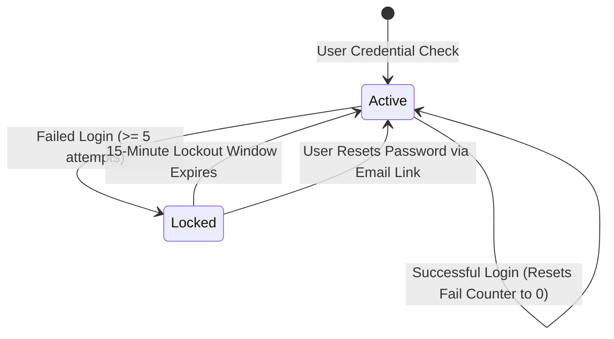

# Phase 27: Account Lockout & Brute Force Engine

> **Author**: Senior Backend Architect & Security Lead  
> **Phase**: 27 of 35  
> **Target Path**: `docs/27-account-lockout.md`  

---

## 1. Learning Objectives

By completing this phase, you will master:
* Protecting authentication endpoints against credential stuffing and brute-force dictionary attacks.
* Implementing Progressive Backoff Delays and Account Lockout routines using Redis counters.
* Balancing security protections against Denial of Wallet / User Lockout DoS attacks.
* Building automatic account unlock timers and email notification triggers.

---

## 2. Lockout State Machine Architecture



---

## 3. Production Account Lockout Engine Implementation

File path: `core/security/lockout.py`

```python
"""
Redis-backed Progressive Account Lockout Engine.
Tracks consecutive login failures per email and IP address.
"""
from django.core.cache import cache
from datetime import datetime, timezone, timedelta
from core.exceptions import SecurityException


class AccountLockoutEngine:

    MAX_FAILED_ATTEMPTS = 5
    LOCKOUT_DURATION_SECONDS = 900 # 15 minutes
    COUNTER_PREFIX = "login_fail_count:"
    LOCK_PREFIX = "account_locked:"

    @classmethod
    def record_failed_attempt(cls, email: str, ip_address: str) -> int:
        """
        Increments failed attempt counter for email + IP pair.
        If threshold reached, locks the account for LOCKOUT_DURATION_SECONDS.
        """
        email_clean = email.strip().lower()
        fail_key = f"{cls.COUNTER_PREFIX}{email_clean}"
        lock_key = f"{cls.LOCK_PREFIX}{email_clean}"

        # Increment attempts counter
        current_fails = cache.get(fail_key, 0) + 1
        cache.set(fail_key, current_fails, timeout=cls.LOCKOUT_DURATION_SECONDS)

        if current_fails >= cls.MAX_FAILED_ATTEMPTS:
            # Lock the account
            cache.set(lock_key, "locked", timeout=cls.LOCKOUT_DURATION_SECONDS)
            
            # Reset fail counter
            cache.delete(fail_key)
            
            raise SecurityException(
                message=f"Account locked due to {cls.MAX_FAILED_ATTEMPTS} consecutive failed login attempts. Try again in 15 minutes.",
                status_code=429
            )

        return current_fails

    @classmethod
    def check_lockout_status(cls, email: str) -> None:
        """
        Guards login endpoint. Raises exception if account is currently locked out.
        """
        email_clean = email.strip().lower()
        lock_key = f"{cls.LOCK_PREFIX}{email_clean}"
        
        if cache.get(lock_key) is not None:
            ttl = cache.ttl(lock_key) or cls.LOCKOUT_DURATION_SECONDS
            minutes_left = max(1, int(ttl // 60))
            raise SecurityException(
                message=f"Account is currently locked out. Please try again in {minutes_left} minutes or reset your password.",
                status_code=429
            )

    @classmethod
    def reset_failed_attempts(cls, email: str) -> None:
        """
        Resets failure counters upon successful authentication.
        """
        email_clean = email.strip().lower()
        fail_key = f"{cls.COUNTER_PREFIX}{email_clean}"
        lock_key = f"{cls.LOCK_PREFIX}{email_clean}"
        
        cache.delete(fail_key)
        cache.delete(lock_key)
```

---

## 4. Mentor Mode: Self-Check & Exercises

### Self-Check Questions
1. **Why should we lock accounts based on a combination of `Email` and `IP Address` rather than `Email` alone?**  
   *Answer: Locking accounts based exclusively on Email makes the system vulnerable to Account Lockout DoS attacks, where an attacker intentionally submits wrong passwords for targeted users to lock them out of their accounts. Dual IP + Email tracking mitigates this.*

2. **Why must failure counters reset to 0 upon a successful login?**  
   *Answer: Because legitimate users occasionally misspell passwords. If counters did not reset on success, sporadic typos over time would accumulate and eventually lock out valid users.*

### Practical Exercise
* Extend `AccountLockoutEngine` to trigger an automated security notification email to the account owner when their account enters the `Locked` state.
