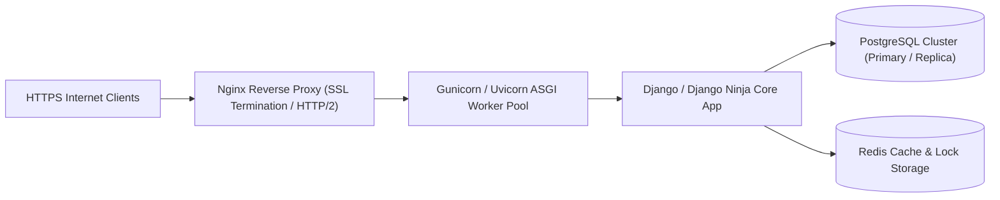

# Phase 33: Production Deployment & Hardening

> **Author**: Senior Backend Architect & Security Lead  
> **Phase**: 33 of 35  
> **Target Path**: `docs/33-production-deployment.md`  

---

## 1. Learning Objectives

By completing this phase, you will master:
* Deploying Python/Django authentication applications behind production WSGI/ASGI servers (Gunicorn / Uvicorn).
* Hardening reverse proxy configurations using Nginx for TLS/SSL termination, HTTP/2, and request buffering.
* Managing production secrets and environment isolation (HashiCorp Vault / AWS Secrets Manager / 12-Factor App).
* Configuring systemd process management, health checks, and zero-downtime rolling deployments.

---

## 2. Production Architecture Blueprint



---

## 3. Production Hardening Configurations

### 1. Gunicorn / Uvicorn Execution Script

File path: `scripts/gunicorn_start.sh`

```bash
#!/bin/bash
# Production Startup Script for Gunicorn with Uvicorn ASGI Workers

NAME="auth_system"
DIR=/app
USER=appuser
GROUP=appgroup
WORKERS=4
WORKER_CLASS=uvicorn.workers.UvicornWorker
BIND=0.0.0.0:8000
LOG_LEVEL=info

echo "Starting $NAME as $(whoami)..."

exec gunicorn config.asgi:application \
  --name $NAME \
  --workers $WORKERS \
  --worker-class $WORKER_CLASS \
  --user $USER \
  --group $GROUP \
  --bind $BIND \
  --log-level $LOG_LEVEL \
  --access-logfile - \
  --error-logfile -
```

### 2. Production Nginx Reverse Proxy Config

File path: `deploy/nginx/auth_system.conf`

```nginx
# Production Nginx Reverse Proxy with TLS Hardening
upstream django_app {
    server 127.0.0.1:8000 fail_timeout=0;
}

server {
    listen 80;
    server_name auth.yourdomain.com;
    return 301 https://$host$request_uri; # Redirect HTTP to HTTPS
}

server {
    listen 443 ssl http2;
    server_name auth.yourdomain.com;

    # SSL Certificates
    ssl_certificate /etc/letsencrypt/live/auth.yourdomain.com/fullchain.pem;
    ssl_certificate_key /etc/letsencrypt/live/auth.yourdomain.com/privkey.pem;

    # TLS Protocols & Ciphers
    ssl_protocols TLSv1.2 TLSv1.3;
    ssl_ciphers ECDHE-ECDSA-AES128-GCM-SHA256:ECDHE-RSA-AES128-GCM-SHA256:ECDHE-ECDSA-AES256-GCM-SHA384;
    ssl_prefer_server_ciphers on;
    ssl_session_timeout 1d;
    ssl_session_cache shared:SSL:10m;

    # Security Headers
    add_header Strict-Transport-Security "max-age=63072000; includeSubDomains; preload" always;
    add_header X-Frame-Options "DENY" always;
    add_header X-Content-Type-Options "nosniff" always;
    add_header Referrer-Policy "strict-origin-when-cross-origin" always;

    # Request Body Size Limit (Mitigates Large File Payload DoS)
    client_max_body_size 10M;

    location / {
        proxy_pass http://django_app;
        proxy_set_header X-Forwarded-For $proxy_add_x_forwarded_for;
        proxy_set_header X-Forwarded-Proto $scheme;
        proxy_set_header Host $http_host;
        proxy_redirect off;
    }

    location /static/ {
        alias /app/staticfiles/;
        expires 30d;
        add_header Cache-Control "public, no-transform";
    }
}
```

---

## 4. Production Security Checklist

* [ ] `DEBUG = False` verified in production `.env`.
* [ ] `SECRET_KEY` generated via `openssl rand -hex 32` and managed in secret vault.
* [ ] Database passwords and API keys removed from source control (`.gitignore` enforced).
* [ ] SSL/TLS certificate configured with automated certbot renewal.
* [ ] PostgreSQL database connections encrypted over TLS (`sslmode=require`).
* [ ] Non-root Docker container execution enforced (`USER appuser`).
* [ ] Database backups automated (daily pg_dump snapshots with encrypted S3 offsite storage).

---

## 5. Mentor Mode: Self-Check & Exercises

### Self-Check Questions
1. **Why must `DEBUG = False` always be set in production?**  
   *Answer: Setting `DEBUG = True` in production enables Django's interactive debugging tool (Werkzeug/Django debug page), allowing arbitrary remote code execution (RCE) and revealing all environment secrets to unauthenticated visitors.*

2. **What is the purpose of Nginx proxying requests to Gunicorn instead of exposing Gunicorn directly to the public internet?**  
   *Answer: Nginx excels at handling slow clients, SSL termination, DDoS rate limiting, static asset serving, and request buffering, protecting Gunicorn application workers from exhaustion attacks (e.g. Slowloris).*

### Practical Exercise
* Write a bash health-check script (`scripts/health_check.sh`) that queries `/api/v1/health` and automatically restarts the systemd service if 3 consecutive checks fail.
