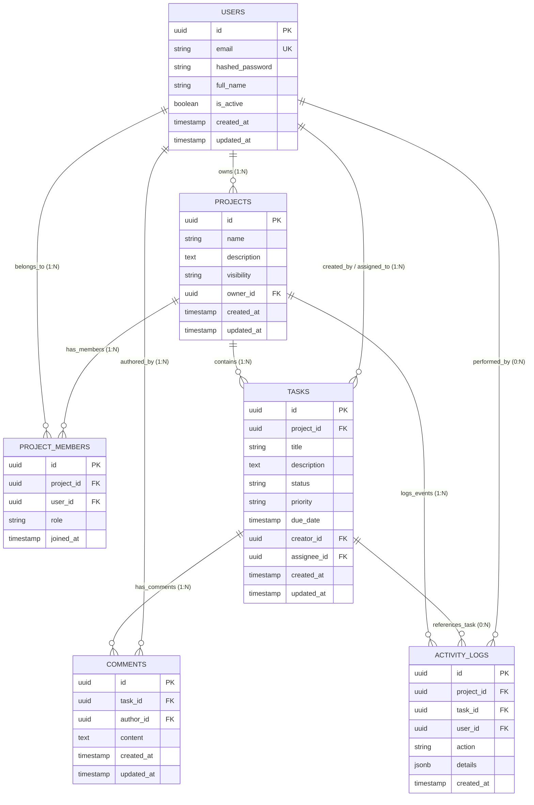

# ResourceHub — Database Schema & Entity Relationship Model (Day 3)

## 1. Executive Summary & Modeling Goals

Day 3 focuses on relational database design, schema normalization, structural integrity constraints, foreign key cascading strategies, and cardinality modeling for **ResourceHub**.

---

## 2. Entity Relationship (ER) Diagram



---

## 3. Detailed Entity Definitions & SQL DDL Schema

### 3.1 `users` Table
Stores registered user accounts, authentication credentials, and user status.

```sql
CREATE TABLE users (
    id UUID PRIMARY KEY DEFAULT gen_random_uuid(),
    email VARCHAR(255) NOT NULL UNIQUE,
    hashed_password VARCHAR(255) NOT NULL,
    full_name VARCHAR(255) NOT NULL,
    is_active BOOLEAN NOT NULL DEFAULT TRUE,
    created_at TIMESTAMPTZ NOT NULL DEFAULT CURRENT_TIMESTAMP,
    updated_at TIMESTAMPTZ NOT NULL DEFAULT CURRENT_TIMESTAMP
);

CREATE INDEX idx_users_email ON users(email);
```

### 3.2 `projects` Table
Stores enterprise projects created by users.

```sql
CREATE TABLE projects (
    id UUID PRIMARY KEY DEFAULT gen_random_uuid(),
    name VARCHAR(255) NOT NULL,
    description TEXT,
    visibility VARCHAR(50) NOT NULL DEFAULT 'PRIVATE' 
        CHECK (visibility IN ('PUBLIC', 'PRIVATE', 'INTERNAL')),
    owner_id UUID NOT NULL REFERENCES users(id) ON DELETE RESTRICT,
    created_at TIMESTAMPTZ NOT NULL DEFAULT CURRENT_TIMESTAMP,
    updated_at TIMESTAMPTZ NOT NULL DEFAULT CURRENT_TIMESTAMP
);

CREATE INDEX idx_projects_owner_id ON projects(owner_id);
```

### 3.3 `project_members` Table (Junction / Join Table)
Resolves the **N:M (Many-to-Many)** relationship between `users` and `projects` with explicit Role-Based Access Control (RBAC).

```sql
CREATE TABLE project_members (
    id UUID PRIMARY KEY DEFAULT gen_random_uuid(),
    project_id UUID NOT NULL REFERENCES projects(id) ON DELETE CASCADE,
    user_id UUID NOT NULL REFERENCES users(id) ON DELETE CASCADE,
    role VARCHAR(50) NOT NULL DEFAULT 'MEMBER'
        CHECK (role IN ('OWNER', 'ADMIN', 'MEMBER', 'VIEWER')),
    joined_at TIMESTAMPTZ NOT NULL DEFAULT CURRENT_TIMESTAMP,
    CONSTRAINT uq_project_member UNIQUE (project_id, user_id)
);

CREATE INDEX idx_project_members_project_id ON project_members(project_id);
CREATE INDEX idx_project_members_user_id ON project_members(user_id);
```

### 3.4 `tasks` Table
Stores task items within projects.

```sql
CREATE TABLE tasks (
    id UUID PRIMARY KEY DEFAULT gen_random_uuid(),
    project_id UUID NOT NULL REFERENCES projects(id) ON DELETE CASCADE,
    title VARCHAR(255) NOT NULL,
    description TEXT,
    status VARCHAR(50) NOT NULL DEFAULT 'TODO'
        CHECK (status IN ('TODO', 'IN_PROGRESS', 'IN_REVIEW', 'COMPLETED', 'ARCHIVED')),
    priority VARCHAR(50) NOT NULL DEFAULT 'MEDIUM'
        CHECK (priority IN ('LOW', 'MEDIUM', 'HIGH', 'URGENT')),
    due_date TIMESTAMPTZ,
    creator_id UUID REFERENCES users(id) ON DELETE SET NULL,
    assignee_id UUID REFERENCES users(id) ON DELETE SET NULL,
    created_at TIMESTAMPTZ NOT NULL DEFAULT CURRENT_TIMESTAMP,
    updated_at TIMESTAMPTZ NOT NULL DEFAULT CURRENT_TIMESTAMP
);

CREATE INDEX idx_tasks_project_id ON tasks(project_id);
CREATE INDEX idx_tasks_status ON tasks(status);
CREATE INDEX idx_tasks_assignee_id ON tasks(assignee_id);
```

### 3.5 `comments` Table
Stores user comments attached to specific tasks.

```sql
CREATE TABLE comments (
    id UUID PRIMARY KEY DEFAULT gen_random_uuid(),
    task_id UUID NOT NULL REFERENCES tasks(id) ON DELETE CASCADE,
    author_id UUID NOT NULL REFERENCES users(id) ON DELETE CASCADE,
    content TEXT NOT NULL,
    created_at TIMESTAMPTZ NOT NULL DEFAULT CURRENT_TIMESTAMP,
    updated_at TIMESTAMPTZ NOT NULL DEFAULT CURRENT_TIMESTAMP
);

CREATE INDEX idx_comments_task_id ON comments(task_id);
```

### 3.6 `activity_logs` Table
Stores immutable audit log records for domain activity.

```sql
CREATE TABLE activity_logs (
    id UUID PRIMARY KEY DEFAULT gen_random_uuid(),
    project_id UUID NOT NULL REFERENCES projects(id) ON DELETE CASCADE,
    task_id UUID REFERENCES tasks(id) ON DELETE SET NULL,
    user_id UUID REFERENCES users(id) ON DELETE SET NULL,
    action VARCHAR(100) NOT NULL,
    details JSONB,
    created_at TIMESTAMPTZ NOT NULL DEFAULT CURRENT_TIMESTAMP
);

CREATE INDEX idx_activity_logs_project_id ON activity_logs(project_id);
```

---

## 4. Key Database Modeling Concepts Explained

### 1. Primary Keys (PK)
* **UUID vs. Auto-Incrementing Integer:**
  We use `UUIDv4` (`gen_random_uuid()`) for primary keys instead of auto-incrementing integers (`1, 2, 3...`).
  * **Why:** Auto-increment integers expose total database record counts to attackers (e.g. `GET /tasks/100` tells a user there are ~100 tasks in system) and cause ID collision issues in distributed multi-region databases. UUIDs are globally unique, non-enumerable, and can be safely generated client-side or application-side.

### 2. Foreign Keys (FK) & Cascading Rules
* **Foreign Key:** Enforces referential integrity, ensuring a record in a child table points to a valid record in a parent table.
* **Cascading Rules:**
  * `ON DELETE CASCADE`: Used for child entities tied strictly to parent lifespan (e.g., deleting a Project automatically deletes all associated `tasks`, `project_members`, and `comments`).
  * `ON DELETE SET NULL`: Used when preserving history is important (e.g., deleting a user sets `tasks.assignee_id` to `NULL` rather than deleting the task itself).
  * `ON DELETE RESTRICT`: Prevents parent deletion if child records exist (e.g., prevents deleting a User who owns projects until ownership is transferred).

### 3. Structural Constraints
* **`NOT NULL`:** Guarantees mandatory data fields (e.g. `email`, `title`, `status`).
* **`UNIQUE`:** Enforces distinct values across the table (e.g., `users.email`).
* **`UNIQUE(project_id, user_id)`:** Composite unique constraint preventing a user from being added to the same project multiple times.
* **`CHECK` Constraints:** Validates data against allowed enums (e.g. `status IN ('TODO', 'IN_PROGRESS', ...)`).

### 4. Relationships & Cardinality
* **1-to-Many (1:N):** One entity relates to multiple instances of another.
  * *Example:* 1 Project has N Tasks (`projects.id` ─── `tasks.project_id`).
* **Many-to-Many (N:M):** Multiple entities relate to multiple entities.
  * *Example:* N Users belong to M Projects. Solved using `project_members` as a **junction table** storing payload attributes like `role` and `joined_at`.

### 5. Database Normalization (1NF, 2NF, 3NF)
* **First Normal Form (1NF):** All table columns hold atomic (indivisible) values. (No comma-separated strings for assignees or tags).
* **Second Normal Form (2NF):** Table is in 1NF and all non-key attributes are fully functionally dependent on the primary key.
* **Third Normal Form (3NF):** Table is in 2NF and has no transitive dependencies (non-key attributes do not depend on other non-key attributes).
  * *Example:* `comments` stores `author_id` FK to `users`, but does **not** duplicate `author_email` or `author_name` inside `comments`.
